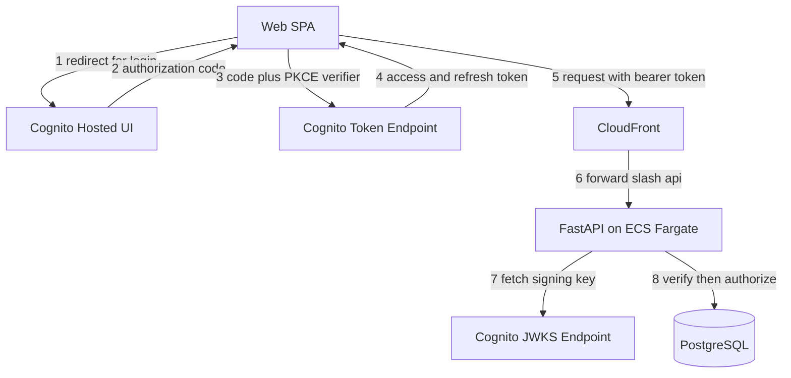
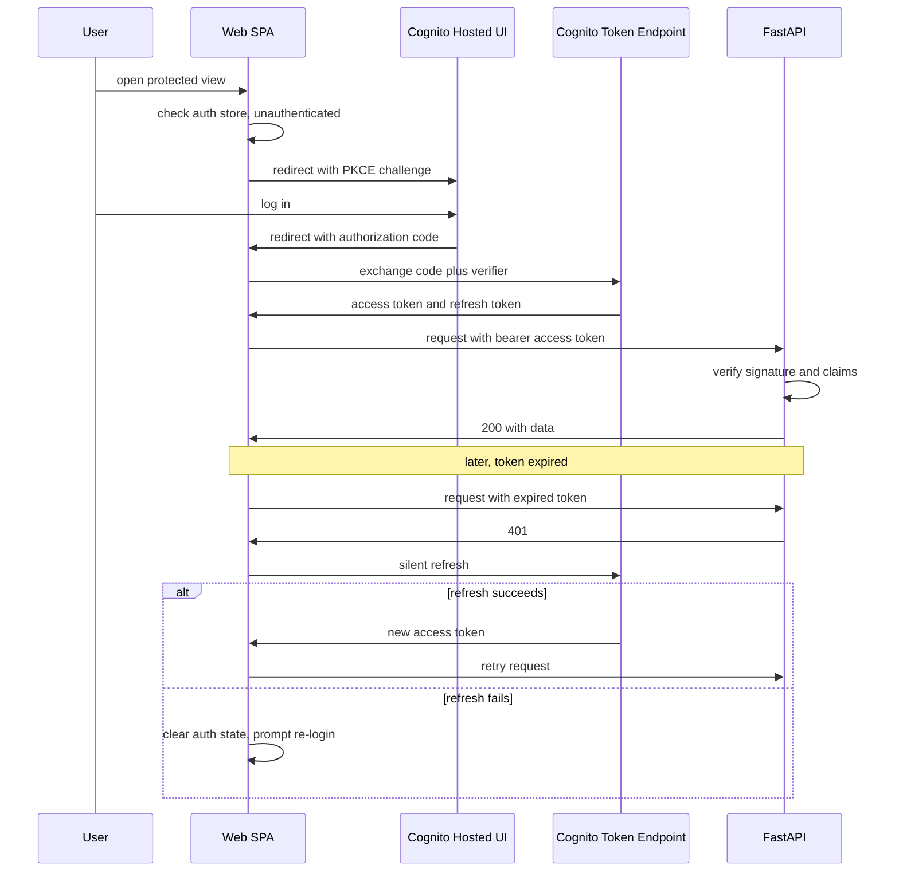

# Technical Design

## Overview

**Purpose**: `services/backend/python` の保護対象エンドポイントを未認証アクセスから守り、権限不足の操作を拒否できるようにする。あわせて `services/frontend` にログイン・ログアウト・セッション失効時の再認証誘導を実装する。認証基盤には AWS Cognito（Hosted UI、Authorization Code + PKCE）を採用する。

**Users**: API運用者（保護対象リソースへのアクセス制御を必要とする）、エンドユーザー（Web アプリでログイン/ログアウトし、保護された機能を利用する）、システム運用者（機密情報の非露出を必要とする）。

**Impact**: 現状すべて無認証の `services/backend/python`（`items` 一覧/取得/作成、`health`）に、JWTベースの認証・スコープベースの認可を追加する。`services/frontend` にはログイン画面・認証状態管理・ルートガードを新設する。`infra/` に Cognito User Pool を新規プロビジョニングする。既存のモノレポ構成（[ADR-0003](../../../docs/adr/0003-keep-monorepo-through-domain-and-authn-expansion.md)）は変更しない。

### Goals

- 保護対象エンドポイントへの未認証アクセスを401で拒否する（1.1-1.4）
- 権限不足（read権限のみでwrite操作）の操作を403で拒否する（2.1-2.3）
- Web アプリでログイン・ログアウト・認証状態表示を提供する（3.1-3.5）
- セッション失効時に再認証を促す（4.1-4.2）
- 認証関連の機密情報をブラウザ・リポジトリに露出させない（5.1-5.2）

### Non-Goals

- 具体的な認証方式以外の選択肢の実装（本設計でCognito/JWTに確定する）
- read/writeを超えるロール・スコープ体系、リソース所有者ベースの認可（Issue #40）
- WAF・レート制限などネットワーク層の防御（Issue #44）
- 多要素認証・パスワードリセット・セルフサービスアカウント管理・ユーザー管理UI
- 独自ドメイン・ACM証明書の整備（既存の `*.cloudfront.net` で本設計は完結する）
- httpOnly Cookieによるリフレッシュトークン管理（BFF/エッジ関数が必要になるため今回は見送り、Open Questionsに記録）

## Boundary Commitments

### This Spec Owns

- `services/backend/python` における JWTの検証（署名/`client_id`/`iss`/`exp`/`token_use`。Cognitoアクセストークンに`aud`は無いため`client_id`で代替）と、読み取り/書き込みスコープに基づく認可判定
- `services/frontend` における Cognito Hosted UI へのログイン誘導・コールバック処理・ログアウト・認証状態のメモリ保持・保護ルートのガード・APIクライアントへのAuthorizationヘッダー付与・401時の再認証誘導
- `infra/` における Cognito User Pool・Resource Server（カスタムスコープ）・User Pool Client・Hosted UI ドメインのプロビジョニングと、非機密の識別子（user pool ID・client ID・ドメイン・リージョン）の出力
- `health` エンドポイントを認証対象から除外し続けること

### Out of Boundary

- read/writeを超えるロール・スコープ体系、`items`以外のドメインリソースの所有者ベース認可（Issue #40 で扱う）
- WAF・レート制限等のネットワーク層防御（Issue #44 で扱う）
- Cognitoユーザーへのスコープ付与を行う管理UI・セルフサービス機能（現状は手動運用を前提とする）
- ALBリスナーでの認証（`authenticate-cognito` アクション）— JSON APIの401/403契約と相性が悪いため不採用
- カスタムドメイン・ACM証明書の整備

### Allowed Dependencies

- 既存の ECS Fargate / ALB / CloudFront / S3 トポロジ（変更しない。新規リスナールールやHTTPS化は行わない）
- 既存の FastAPI `Depends` パターン、`app.dependency_overrides` によるテスト手法
- 既存の Pinia / vue-router / TanStack Vue Query、`src/api/client.ts` の単一 `request()` 差し込み点
- [ADR-0003](../../../docs/adr/0003-keep-monorepo-through-domain-and-authn-expansion.md)（モノレポ構成を維持する前提）

### Revalidation Triggers

- アクセストークンのclaims形状（スコープ名・カスタムクレーム）を変更する場合
- Cognito User Pool のユーザー属性・グループ構成を変更する場合
- Issue #40 でリソース所有者ベースの認可を追加する場合（本specのスコープモデルとの整合確認が必要）
- リフレッシュトークンの保管方式を変更する場合（例: BFF/エッジ関数の追加）
- カスタムドメイン・ACM証明書が整備され、`callback_urls` を変更する場合
- Cognitoトークンエンドポイントのブラウザ直接fetchがCORS制約で利用できず、コード交換用プロキシ（CloudFront Function等）を追加する場合

## Architecture

### Existing Architecture Analysis

- `services/backend/python/src/api/main.py` はミドルウェア無し、ルーターごとに個別の `Depends` を宣言する構成。認証層もこのパターンに従い、ルーター側で `Security(...)` を宣言する形にする（グローバルミドルウェアは追加しない）。
- `items.py` は GET（一覧/単体）とPOST（作成）を持つ。GETに `api/items.read`、POSTに `api/items.write` スコープを要求する。`health.py` は変更しない。
- `services/frontend/src/api/client.ts` の `request()` が唯一のfetch呼び出し口 — ここにAuthorizationヘッダー付与と401ハンドリングを追加する。
- `services/frontend/src/router/index.ts` はフラットでガード無し、`stores/` に認証系ストアも無い — 新設が必要。
- `infra/*.tf` はフラットなTerraformファイル構成、ALBはHTTPリスナーのみで認証機構は無い — 新規 `auth.tf` を追加するのみで既存トポロジは変更しない。

### Architecture Pattern & Boundary Map



**Architecture Integration**:

- 選定パターン: Authorization Code + PKCE によるトークン取得（フロント）＋ リソースサーバー側JWT検証（API）。ALBレベル認証は不採用（Boundary参照）。
- ドメイン境界: 「認証（誰か）」はCognito、「認可（何ができるか）」はAPI側のスコープ判定、「セッションUX」はフロントのPiniaストアが担当し、責任が重複しないようにする。
- 既存パターンの維持: `Depends`ベースのFastAPI DI、`client.ts`の単一fetch口、Pinia setup-store、`router.beforeEach`ガード、Terraformのフラットな `*.tf` 構成。
- 新規コンポーネントの理由: JWKS検証・スコープ判定はAPIの新しい責務のため `auth/` パッケージとして分離。フロントは設定・型を `auth/` に、状態管理は既存の `stores/` 規約（`stores/counter.ts`と同じ配置）に従い `stores/auth.ts` に置く。
- Steering準拠: `raw SQL禁止`・`Depends経由のDB取得`・`vue-tsc型チェック`・`VITE_プレフィックス非機密のみ`をすべて維持する。

### Technology Stack

| Layer                    | Choice / Version                          | Role in Feature                                     | Notes                                                                |
| ------------------------ | ----------------------------------------- | --------------------------------------------------- | -------------------------------------------------------------------- |
| Backend / Services       | PyJWT (`PyJWKClient`)                     | Cognito発行JWTの署名・claims検証、JWKSキャッシュ    | python-joseは不採用（保守停止・脆弱性）。research.md参照             |
| Frontend / CLI           | `oidc-client-ts`                          | Authorization Code + PKCEフローの実行、トークン管理 | Amplifyは不採用（バンドルサイズ・tree-shakingバグ）。research.md参照 |
| Infrastructure / Runtime | AWS Cognito User Pool（Essentialsティア） | IdP、Hosted UI、JWT発行、JWKS公開                   | Plusティア（脅威保護）は今回不要                                     |

## File Structure Plan

### Directory Structure

```
services/backend/python/src/api/
├── auth/                       # 認証・認可ドメイン（新規）
│   ├── __init__.py
│   ├── jwks.py                 # PyJWKClient シングルトン、署名鍵取得
│   ├── dependencies.py         # get_current_user（Security）、require_scope ファクトリ
│   └── schemas.py              # AuthenticatedUser（sub, scopes）
├── config.py                   # 変更: cognito_user_pool_id / region / client_id / issuer 追加
└── routers/
    ├── items.py                # 変更: 各エンドポイントに Security(get_current_user, scopes=[...]) 追加
    └── health.py                # 変更なし（認証対象外を明示するコメントのみ）

services/frontend/src/
├── auth/                       # 認証ドメイン（新規）
│   ├── oidcConfig.ts           # oidc-client-ts の UserManager 設定
│   └── types.ts                # AuthenticatedUser, AuthState 等の型定義
├── stores/
│   └── auth.ts                 # Pinia setup-store（既存 stores/ 規約に合わせる。counter.ts と同じ配置）
├── views/
│   ├── LoginView.vue           # 新規: ログイン開始（Hosted UIへリダイレクト）
│   └── AuthCallbackView.vue    # 新規: OIDCコールバック処理
├── router/index.ts             # 変更: /login, /callback ルート追加、beforeEach ガード追加
├── api/client.ts               # 変更: request() にAuthorizationヘッダー付与・401時のrefresh-or-logout追加
└── components/
    └── AuthStatusBadge.vue     # 新規: ログイン状態表示（Requirement 3.3）

infra/
├── auth.tf                     # 新規: aws_cognito_user_pool / aws_cognito_resource_server /
│                                #       aws_cognito_user_pool_client / aws_cognito_user_pool_domain
├── outputs.tf                  # 変更: cognito_user_pool_id 等の非機密出力を追加
└── variables.tf                # 変更: callback_urls 等の環境固有値を変数化
```

### Modified Files

- `services/backend/python/src/api/config.py` — Cognito関連の設定フィールド（`API_`プレフィックス）を追加。シークレットは扱わない（`generate_secret = false`のため存在しない）。
- `services/backend/python/src/api/routers/items.py` — GET系に `api/items.read`、POST系に `api/items.write` スコープを要求する `Security` 依存を追加。
- `services/backend/python/tests/conftest.py` — `get_current_user` を `app.dependency_overrides` で差し替えるフィクスチャを追加。
- `services/frontend/src/router/index.ts` — `/login`・`/callback` ルートと `meta.requiresAuth` ガードを追加。
- `services/frontend/src/api/client.ts` — `request()` にトークン付与・401時のリフレッシュ/ログアウト処理を追加。
- `infra/outputs.tf` / `infra/variables.tf` — Cognito関連の出力・変数を追加。

## System Flows



主要な判断: 401受信時はフロントで一度だけサイレントリフレッシュを試み、失敗時のみRequirement 4の再認証誘導を表示する（無限リトライを避ける）。

**コード交換のCORS制約**: Cognitoの `/oauth2/token` エンドポイントはブラウザからの直接fetchに対し `Access-Control-Allow-Origin` を返さない場合があることが広く報告されている（実装前に対象User PoolでCORS応答を確認する）。`oidc-client-ts` は既定でこのエンドポイントに直接fetchするため、CORSが利用できない場合は以下いずれかで対応する（実装タスク側で確定する）:

1. Cognito側の設定（Hosted UIドメイン経由のリクエストではCORS制約が緩和されるケースがあるため、Hosted UIのリダイレクトチェーン内で完結させる）で解決できるか検証する
2. 解決できない場合、コード交換だけを担う最小限のプロキシ（CloudFront Function等）を追加する — この場合はBFF化の一部前倒しとして Revalidation Trigger に追加する

## Requirements Traceability

| Requirement | Summary                                    | Components                                              | Interfaces                | Flows              |
| ----------- | ------------------------------------------ | ------------------------------------------------------- | ------------------------- | ------------------ |
| 1.1         | 未認証リクエストは401                      | `auth.dependencies.get_current_user`                    | API Contract (items)      | ログインフロー前段 |
| 1.2         | 有効トークンは認可判定へ                   | `auth.dependencies.get_current_user`                    | API Contract              | —                  |
| 1.3         | 失効/無効トークンは401                     | `auth.jwks`, `auth.dependencies`                        | API Contract              | —                  |
| 1.4         | healthは認証不要のまま                     | `routers.health`（変更なし）                            | API Contract              | —                  |
| 2.1         | read権限のみでwriteは403                   | `auth.dependencies.require_scope`                       | API Contract (items POST) | —                  |
| 2.2         | write権限でwriteは通常処理                 | `auth.dependencies.require_scope`                       | API Contract (items POST) | —                  |
| 2.3         | 認証済みならread許可                       | `auth.dependencies.get_current_user`                    | API Contract (items GET)  | —                  |
| 3.1         | 未認証で保護画面→ログイン誘導              | `router` guard                                          | Router meta               | ログインフロー     |
| 3.2         | ログイン成功で元画面へ                     | `AuthCallbackView`, `authStore`                         | —                         | ログインフロー     |
| 3.3         | ログイン中の表示                           | `AuthStatusBadge`                                       | —                         | —                  |
| 3.4         | ログアウトで状態破棄                       | `authStore.logout`                                      | —                         | —                  |
| 3.5         | ログイン失敗時のエラー表示                 | `AuthCallbackView`                                      | —                         | ログインフロー     |
| 4.1         | 401検知で再認証誘導                        | `client.ts request()`, `authStore`                      | ApiClient                 | リフレッシュフロー |
| 4.2         | 再認証未完了時は保護データを表示継続しない | `authStore`, TanStack Query連携                         | —                         | リフレッシュフロー |
| 5.1         | クライアントシークレット等を非露出         | `infra/auth.tf`（`generate_secret=false`）, `config.py` | —                         | —                  |
| 5.2         | 機密情報をリポジトリに含めない             | `infra/env/*.tfvars.example` パターンの踏襲             | —                         | —                  |

## Components and Interfaces

| Component           | Domain/Layer  | Intent                                                          | Req Coverage          | Key Dependencies (P0/P1)        | Contracts |
| ------------------- | ------------- | --------------------------------------------------------------- | --------------------- | ------------------------------- | --------- |
| JwksVerifier        | API / auth    | JWKS取得・キャッシュ・署名検証                                  | 1.1, 1.3              | Cognito JWKS endpoint (P0)      | Service   |
| AuthDependency      | API / auth    | `get_current_user` / `require_scope` のFastAPI依存関数          | 1.1-1.4, 2.1-2.3      | JwksVerifier (P0)               | Service   |
| ItemsRouter（変更） | API / routers | 既存エンドポイントに認証・認可を適用                            | 1.4, 2.1-2.3          | AuthDependency (P0)             | API       |
| AuthStore           | Web / state   | 認証状態のメモリ保持、login/logout/refresh                      | 3.1-3.5, 4.1-4.2      | oidc-client-ts UserManager (P0) | State     |
| ApiClient（変更）   | Web / api     | Authorizationヘッダー付与、401時のリフレッシュ/ログアウト       | 4.1-4.2               | AuthStore (P0)                  | Service   |
| RouterGuard         | Web / router  | 未認証時の保護ルートブロック・リダイレクト                      | 3.1                   | AuthStore (P0)                  | State     |
| CognitoInfra        | Infra         | User Pool / Resource Server / Client / Hosted UI ドメインの提供 | 1.1-1.4, 2.1-2.3, 5.1 | AWS Cognito (P0)                | —         |

### API / auth

#### JwksVerifier

| Field        | Detail                                                                      |
| ------------ | --------------------------------------------------------------------------- |
| Intent       | Cognito JWKSエンドポイントから署名鍵を取得・キャッシュし、JWT署名を検証する |
| Requirements | 1.1, 1.3                                                                    |

**Responsibilities & Constraints**

- `PyJWKClient` をプロセス起動時に1つだけ生成し（シングルトン）、以後のリクエストで共有する
- JWKS全体は既定300秒でTTLキャッシュ、`kid`未知時は自動再取得する（PyJWT標準機能、独自実装なし）

**Dependencies**

- External: Cognito JWKS endpoint（`https://cognito-idp.{region}.amazonaws.com/{pool_id}/.well-known/jwks.json`）— purpose: 署名鍵取得 (P0)

**Contracts**: Service [x] / API [ ] / Event [ ] / Batch [ ] / State [ ]

##### Service Interface

```python
class JwksVerifier:
    def get_signing_key(self, token: str) -> jwt.PyJWK: ...
```

- Preconditions: `token` はJWT形式の文字列であること
- Postconditions: 対応する `kid` の署名鍵を返す。未知の `kid` の場合はJWKSを再取得してから解決する
- Invariants: JWKSキャッシュは300秒でTTL失効する

#### AuthDependency

| Field        | Detail                                                                                 |
| ------------ | -------------------------------------------------------------------------------------- |
| Intent       | JWT検証結果からユーザーを解決し、要求スコープとの比較で認可判定を行うFastAPI依存関数群 |
| Requirements | 1.1, 1.2, 1.3, 1.4, 2.1, 2.2, 2.3                                                      |

**Responsibilities & Constraints**

- `get_current_user`: `Authorization: Bearer` ヘッダーを取り出し、`JwksVerifier` で署名検証。Cognitoのアクセストークンには `aud` クレームが存在しないため、`jwt.decode` は **`audience=` パラメータを指定せずに呼び出す**（指定すると`aud`欠落で必ず失敗する）。`iss`・`exp` は `jwt.decode` の `issuer=`/既定の`exp`検証に委ね、デコード後のpayloadに対して **`client_id` クレームをアプリのCognitoクライアントIDと手動比較**し、`token_use` が `"access"` であることをあわせて手動検証する。いずれかの検証に失敗した場合は401を送出する。検証成功時は `AuthenticatedUser`（`sub`, `scopes`）を返す。
- `require_scope(scope)`: `SecurityScopes` 経由で要求スコープを受け取り、`AuthenticatedUser.scopes` に含まれない場合は403を送出するファクトリ関数。
- `health` ルーターには適用しない（Requirement 1.4）。

**Dependencies**

- Inbound: `routers.items`（P0）
- Outbound: `JwksVerifier`（P0）

**Contracts**: Service [x] / API [ ] / Event [ ] / Batch [ ] / State [ ]

##### Service Interface

```python
class AuthenticatedUser(BaseModel):
    sub: str
    scopes: list[str]

async def get_current_user(
    security_scopes: SecurityScopes,
    token: str = Depends(oauth2_scheme),
) -> AuthenticatedUser:
    signing_key = jwks_verifier.get_signing_key(token)
    # audience= は指定しない — Cognitoアクセストークンに aud クレームは無い
    payload = jwt.decode(
        token, signing_key.key, algorithms=["RS256"],
        issuer=settings.cognito_issuer,
        options={"require": ["exp", "iss", "client_id", "token_use"]},
    )
    if payload["token_use"] != "access" or payload["client_id"] != settings.cognito_client_id:
        raise HTTPException(status_code=401)
    return AuthenticatedUser(sub=payload["sub"], scopes=payload.get("scope", "").split())

def require_scope(scope: str) -> Callable[[AuthenticatedUser], AuthenticatedUser]: ...
```

- Preconditions: リクエストに `Authorization: Bearer <token>` ヘッダーが存在するか、`oauth2_scheme` が401を送出する
- Postconditions: 検証成功時は `AuthenticatedUser` を返す。スコープ不足時は403を送出する
- Invariants: `token_use` が `access` 以外のトークン（IDトークン等）は常に拒否する。`jwt.decode` に `audience=` は渡さない

**Implementation Notes**

- Integration: `items.py` の各ルートで `Security(get_current_user, scopes=["api/items.read"])`（GET）/ `["api/items.write"]`（POST）を宣言する
- Validation: `conftest.py` に `app.dependency_overrides[get_current_user]` を差し替えるフィクスチャを追加し、実Cognito無しでテストする
- Risks: PyJWKClientのLRU鍵キャッシュは失効鍵を即座には破棄しない（research.md参照、許容リスク）

### Web / auth

#### AuthStore

| Field        | Detail                                                                                                   |
| ------------ | -------------------------------------------------------------------------------------------------------- |
| Intent       | 認証状態（トークン・ユーザー情報）をメモリ保持し、login/logout/silent-refreshを提供するPinia setup-store |
| Requirements | 3.1, 3.2, 3.3, 3.4, 3.5, 4.1, 4.2                                                                        |

**Responsibilities & Constraints**

- アクセストークン・リフレッシュトークンは非永続のstate（`ref`）にのみ保持し、`localStorage`/`sessionStorage`には書き込まない（research.md Design Decisions参照）
- `login()`: `oidc-client-ts` の `UserManager.signinRedirect()` を呼び出しCognito Hosted UIへ遷移する
- `handleCallback()`: コールバックURLのクエリからコード交換を行い、成功時は元の遷移先へ、失敗時はエラー状態を設定する（3.5）
- `logout()`: メモリ上の状態を破棄し、Cognitoの `/logout` エンドポイントへ遷移する
- `refresh()`: サイレントリフレッシュを試み、失敗時は状態を破棄する（4.1, 4.2）

**Dependencies**

- External: `oidc-client-ts` `UserManager`（P0）

**Contracts**: Service [ ] / API [ ] / Event [ ] / Batch [ ] / State [x]

##### State Management

```typescript
// services/frontend/src/auth/types.ts
export interface AuthenticatedUser {
  sub: string;
  scopes: string[];
}

export interface AuthStoreState {
  user: AuthenticatedUser | null;
  isAuthenticated: boolean; // computed: user !== null
}

export interface AuthStoreActions {
  login(): Promise<void>;
  handleCallback(): Promise<void>;
  logout(): Promise<void>;
  refresh(): Promise<boolean>; // true: 成功, false: 失敗（呼び出し元がlogout判断）
  getAccessToken(): string | null; // ApiClient から呼ばれる。永続化しない
}
```

- State model: `user: AuthenticatedUser | null`、`isAuthenticated`（`user !== null` の computed）、`accessToken`（store内部の非公開 `ref`、`getAccessToken()`経由でのみ公開）
- Persistence & consistency: 非永続（メモリのみ）。ページリロードでリセットされる
- Concurrency strategy: `refresh()` は同時多重呼び出しを防ぐため進行中のPromiseを共有する

#### ApiClient（変更）

| Field        | Detail                                                                                 |
| ------------ | -------------------------------------------------------------------------------------- |
| Intent       | 既存 `request()` にAuthorizationヘッダー付与と401時のリフレッシュ/ログアウトを追加する |
| Requirements | 4.1, 4.2                                                                               |

**Responsibilities & Constraints**

- 送信前に `AuthStore` からアクセストークンを取得し `Authorization: Bearer` を付与する
- レスポンスが401の場合、`AuthStore.refresh()` を一度だけ試み、成功時はリクエストを再試行、失敗時は `AuthStore.logout()` を呼びエラーを呼び出し元に伝播する（無限リトライしない）

**Dependencies**

- Outbound: `AuthStore`（P0）

**Contracts**: Service [x] / API [ ] / Event [ ] / Batch [ ] / State [ ]

##### Service Interface

```typescript
// services/frontend/src/api/client.ts の変更差分（型のみ抜粋）
interface RequestOptions extends RequestInit {
  skipAuth?: boolean; // login/callback等、Authorizationヘッダーを付与しないリクエスト用
}

class ApiClient {
  private request<T>(path: string, init?: RequestOptions): Promise<T>;
  // 実装: init.skipAuth が false の場合、authStore.getAccessToken() をAuthorizationヘッダーに付与。
  // 401受信時は authStore.refresh() を1回だけ試行 → 成功時はリクエストを1回だけ再試行、失敗時は authStore.logout() を呼びエラーを再送出する。
}
```

- Preconditions: `skipAuth` 未指定時はデフォルトでAuthorizationヘッダーを付与する
- Postconditions: 401受信かつリフレッシュ成功時は透過的に成功レスポンスを返す。リフレッシュ失敗時は元の401エラーを呼び出し元に伝播する
- Invariants: 401ハンドリングのリトライは常に最大1回（無限ループしない）

**Implementation Notes**

- Integration: 既存の `useHealthQuery` 等TanStack Queryの呼び出し元は変更不要（`client.ts`内部で完結する）
- Validation: `HealthBadge.spec.ts` 等既存テストへの影響が無いことを確認する（`health`は認証不要のため挙動は変わらない）
- Risks: リフレッシュの多重実行（同時に複数リクエストが401を受け取るケース）は `AuthStore.refresh()` のPromise共有で防ぐ

### Web / router, components（サマリのみ）

- **RouterGuard**（`router/index.ts` の `beforeEach`）: `meta.requiresAuth` かつ `!authStore.isAuthenticated` の場合 `/login` へリダイレクトする（3.1）。新規UIコンポーネントは無く、既存パターンの適用のみ。
- **LoginView / AuthCallbackView**: 標準的なリダイレクト起点・コールバック受け口のプレゼンテーションコンポーネント。ロジックは `AuthStore` に委譲する。
- **AuthStatusBadge**: `authStore.isAuthenticated` を表示するだけの表示コンポーネント（3.3）。`HealthBadge.vue` と同等の複雑度。

### Infra

#### CognitoInfra

| Field        | Detail                                                                                   |
| ------------ | ---------------------------------------------------------------------------------------- |
| Intent       | Cognito User Pool・カスタムスコープ・パブリッククライアント・Hosted UIドメインを提供する |
| Requirements | 1.1, 1.2, 1.3, 1.4, 2.1, 2.2, 2.3, 5.1                                                   |

**Responsibilities & Constraints**

- `aws_cognito_user_pool` — ユーザーディレクトリ本体
- `aws_cognito_resource_server`（識別子 `api`）— カスタムスコープ `api/items.read` / `api/items.write` を定義
- `aws_cognito_user_pool_client` — `generate_secret = false`（パブリッククライアント、PKCE前提）、`allowed_oauth_flows = ["code"]`、`callback_urls` に既存CloudFrontドメインを設定
- `aws_cognito_user_pool_domain` — Hosted UI用ドメイン（Cognitoプレフィックスドメイン、ACM証明書不要）
- Essentialsティア（既定）を使用し、Plusティア（脅威保護）は有効化しない

**Dependencies**

- External: AWS Cognito（P0）

**Contracts**: Service [ ] / API [ ] / Event [ ] / Batch [ ] / State [ ]

**Implementation Notes**

- Integration: `outputs.tf` で user pool ID・app client ID・Hosted UIドメイン・リージョンを出力し、API側は `config.py` の環境変数、フロント側は `VITE_`プレフィックスのビルド時変数として消費する（いずれも非機密）
- Validation: `infra/CLAUDE.md` の規約通り、`sandbox/*` ブランチで実AWS適用を検証してから本編にマージする
- Risks: カスタムドメイン未整備のため `callback_urls` は現行の `*.cloudfront.net` を使う。将来カスタムドメインが決まれば1行の変更で追従できる（Revalidation Trigger）

## Data Models

本specは新規の永続化エンティティを持たない。ユーザーディレクトリはCognitoが保持し、APIはJWTの `sub` クレームを一時的な識別子として扱う（DBにユーザーテーブルを追加しない）。

### Domain Model

- `AuthenticatedUser`（値オブジェクト、非永続）: `sub: str`（Cognitoのユーザー識別子）, `scopes: list[str]`（アクセストークンの `scope` クレームから解決）

## Error Handling

### Error Categories and Responses

- **401（未認証/無効トークン）**: `Authorization`ヘッダー欠落、署名検証失敗、`exp`超過、`token_use`不一致のいずれも401を返す（Requirement 1.1, 1.3）。フロントは1回だけサイレントリフレッシュを試み、失敗時はRequirement 4の再認証誘導を表示する。
- **403（権限不足）**: 有効なトークンだが要求スコープを満たさない場合（Requirement 2.1）。フロントはエラーメッセージを表示し、再ログインは促さない（認証自体は成功しているため）。
- **ログイン失敗**（Requirement 3.5）: Cognitoからのエラーコールバック（`error`クエリパラメータ）を検出し、フロントでエラーメッセージを表示する。

### Monitoring

本specでは新規の可観測性基盤（メトリクス/アラーム）は追加しない（Issue #42のスコープ）。既存のCloudWatchログに401/403のアクセスログが残ることを確認する程度に留める。

## Testing Strategy

### Unit Tests

- `JwksVerifier`: ローカル生成したRSA鍵ペアと自前JWKSペイロードを使い、正規署名・不正署名・`kid`不一致を検証する
- `get_current_user`: `exp`超過トークン、`token_use=id`のトークン、`client_id`不一致トークンをそれぞれ401判定することを検証する
- `require_scope`: スコープ有り/無しのユーザーオブジェクトに対する403/通過判定を検証する

### Integration Tests

- `items` GET: 未認証→401、`api/items.read`スコープ有り→200（既存 `test_items.py` を `dependency_overrides` 対応に更新）
- `items` POST: `api/items.read`のみ→403、`api/items.write`あり→201
- `health`: 引き続き未認証で200（Requirement 1.4の回帰確認）

### E2E/UI Tests

- 未認証で保護ルートへアクセス→`/login`へリダイレクトされる（Requirement 3.1、Cognitoへの実リダイレクトはモックしルーターガードの挙動のみ検証する）
- ログアウト操作で認証状態が破棄され、保護ルートへの再アクセスがブロックされる（Requirement 3.4）
- 実Cognito Hosted UIとのフルフロー（ログイン成功パス）はCI自動化の対象外とし、sandbox環境での手動確認に留める（research.md Risks参照）

## Security Considerations

- アクセストークンの検証は必ずアクセストークン（IDトークンではない）に対して行い、`token_use`クレームで種別を強制する（research.md参照）
- アクセストークン・リフレッシュトークンは`localStorage`/`sessionStorage`に保存せず、メモリ保持のみとする
- Cognitoパブリッククライアントは `generate_secret = false` のためクライアントシークレットは存在しない（Requirement 5.1を構成上満たす）
- Cognito Essentialsティアを使用し、Plusティア（脅威保護、コスト増）は本specでは有効化しない

## Open Questions / Risks

- Cognitoトークンエンドポイントのブラウザ直接fetchに対するCORS応答は、実装開始前に対象User Poolで実際に確認する必要がある（System Flows参照）。未対応の場合はプロキシ追加が必要になり、タスクの見積もりに影響する
- リフレッシュトークンをメモリのみで扱うことによるUX低下（ページリロードで再ログインが必要）は許容するトレードオフとして記録する。将来的にBFF/エッジ関数によるhttpOnly Cookie化を検討する余地がある（Revalidation Trigger）
- Cognito Hosted UIとのフルE2Eフローの自動テストはCI環境の制約上見送る。sandbox環境での手動確認手順をタスクフェーズで定義する
- read/writeスコープを超えるロール管理・ユーザーへのスコープ付与は手動運用となる（Issue #40でのドメイン拡充時に見直す）
