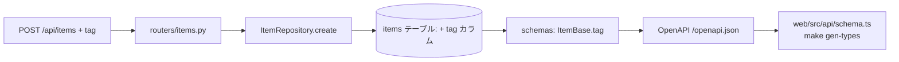

# Design Document — items に `tag` フィールドを追加

## Overview

**Purpose**: `items` に任意の分類用フィールド `tag`（`str | None`）を追加し、作成・取得・一覧で
値が往復するようにする。
**Users**: API 利用者（および将来 items UI を作るフロント開発者）が、item を軽量に分類できる。
**Impact**: `items` テーブルに 1 カラム追加、API 契約（OpenAPI）に 1 フィールド追加。既存の
`description`（nullable な任意文字列）と完全に同じパターンで実装するため、影響は局所的。

### Goals

- `tag` を作成リクエストで受け取り、保存し、取得・一覧で返す。
- 既存データ・既存テスト・既存ワークフローを壊さない（後方互換の nullable 追加）。
- SDD 一周（requirements → design → tasks → 実装）の最小実例を残す。

### Non-Goals

- `tag` による検索・絞り込み・集計。
- items の更新（PUT/PATCH）/削除エンドポイントの新設。
- フロント UI への表示（items の UI は現状未実装）。

## Boundary Commitments

### This Spec Owns

- `items` の `tag` フィールドの定義（モデル・スキーマ・永続化・API 契約）。
- `tag` 追加のマイグレーション（`0002`）。

### Out of Boundary

- items の認証・認可（別途 #41）。
- items UI（別途）。`tag` 検索（将来）。

### Allowed Dependencies

- 既存の `ItemRepository` / `get_session` / Alembic 基盤に依存してよい。
- 新しい外部依存・新ライブラリは導入しない。

### Revalidation Triggers

- `Item` / `ItemCreate` の契約形状が変わるため、フロント生成型 `schema.ts` の再生成が必須。

## Architecture

### Existing Architecture Analysis

既存の `description` フィールドが「モデル → スキーマ（`ItemBase`）→ リポジトリ `create()` の
明示列挙 → マイグレーション → OpenAPI → 生成型」という経路をたどっている。`tag` は**この経路を
そのまま複製**する。router 層は `ItemCreate` / `Item` を介して透過的にフィールドを通すため変更不要。

### Architecture Pattern & Boundary Map

レイヤード（router → repository → model）。新規コンポーネントなし、既存パターンの踏襲のみ。

### Technology Stack

| Layer              | Choice / Version                  | Role in Feature                      | Notes                          |
| ------------------ | --------------------------------- | ------------------------------------ | ------------------------------ |
| Backend / Services | FastAPI / Pydantic                | `tag` を request/response 契約に追加 | `ItemBase` に 1 行             |
| Data / Storage     | SQLAlchemy 2.0 async / PostgreSQL | `items.tag` カラム                   | `Mapped[str \| None]`          |
| Migration          | Alembic                           | `0002_add_tag_to_items`              | `down_revision="0001"`         |
| Frontend           | openapi-typescript                | 生成型の追従                         | `make gen-types`（手書き禁止） |

## File Structure Plan

### Modified Files

- `services/api/src/api/db/models/item.py` — `ItemModel` に `tag: Mapped[str | None] = mapped_column(nullable=True)` を追加。
- `services/api/src/api/schemas/item.py` — `ItemBase` に `tag: str | None = None` を追加（`ItemCreate` / `Item` に自動波及）。
- `services/api/src/api/repositories/items.py` — `create()` 内の `ItemModel(...)` 引数に `tag=data.tag` を追加（明示列挙のため必須）。
- `services/api/alembic/versions/0002_add_tag_to_items.py` — **新規**。`tag` カラムを nullable で `add_column` / `drop_column`。
- `services/web/src/api/schema.ts` — **生成物**。`make gen-types` の出力をコミット（手編集しない）。
- `services/api/tests/test_items.py` — `tag` の往復・未指定時の挙動を検証するアサーション追加。

> router（`routers/items.py`）は変更不要。

## Data Models

### Physical Data Model（PostgreSQL）

`items` テーブルに以下を追加:

| Column | Type    | Null | Default | 備考                                              |
| ------ | ------- | ---- | ------- | ------------------------------------------------- |
| tag    | VARCHAR | YES  | NULL    | 既存 `description` と同じく長さ指定なし・nullable |

- 主キー・既存カラム（`id` / `name` / `description`）は変更なし。
- 後方互換: 既存行は `tag = NULL` になり、データ移行不要。

### マイグレーション（`0002_add_tag_to_items.py`）

- `revision = "0002"`, `down_revision = "0001"`。
- `upgrade()`: `op.add_column("items", sa.Column("tag", sa.String(), nullable=True))`
- `downgrade()`: `op.drop_column("items", "tag")`
- 生成は `make makemigration m="add tag to items"`（autogenerate）→ 生成物の `down_revision` と
  add/drop 内容を確認してからコミット。

### Data Contracts & Integration（OpenAPI）

- `ItemCreate`: `{ name: string, description?: string|null, tag?: string|null }`
- `Item`（response）: `{ id: number, name: string, description?: string|null, tag?: string|null }`
- フロントは `make gen-types` で `schema.ts` を再生成（`Item` / `ItemCreate` に `tag` が反映）。

## Error Handling

- `tag` は任意・型は文字列。未指定は `null` で正常（Requirement 1.2/1.3）。
- 不正型（例: 数値）を送った場合は FastAPI/Pydantic が 422 を返す（既存挙動どおり、追加実装不要）。

## Testing Strategy

### Unit / Integration Tests（`tests/test_items.py`、pytest）

1. `tag` 付き `POST /api/items` → 201、レスポンスに同じ `tag`。
2. その item を `GET /api/items/{id}` → 同じ `tag` が返る。
3. `tag` 未指定 `POST` → 201、`tag` が `null`。
4. `GET /api/items` 一覧に `tag` フィールドが含まれる。

> conftest は in-memory SQLite をメタデータから生成するため、モデルに `tag` を足せばテスト DB に
> 自動反映され、fixture 変更は不要。

### Requirements Traceability

| Requirement     | 実現する設計要素                                                                    |
| --------------- | ----------------------------------------------------------------------------------- |
| 1.1 / 1.2 / 1.3 | `ItemBase.tag`（nullable default None）＋ `repositories.create()` の `tag=data.tag` |
| 2.1 / 2.2 / 2.3 | `Item.tag`（response schema・`from_attributes`）                                    |
| 3.1 / 3.2       | `0002_add_tag_to_items`（`down_revision=0001`・nullable add_column）                |
| 3.3             | `make gen-types` による `schema.ts` 再生成                                          |
| 3.4 / 4.1 / 4.2 | `tests/test_items.py` の追加アサーション＋CI（alembic + pytest）                    |
