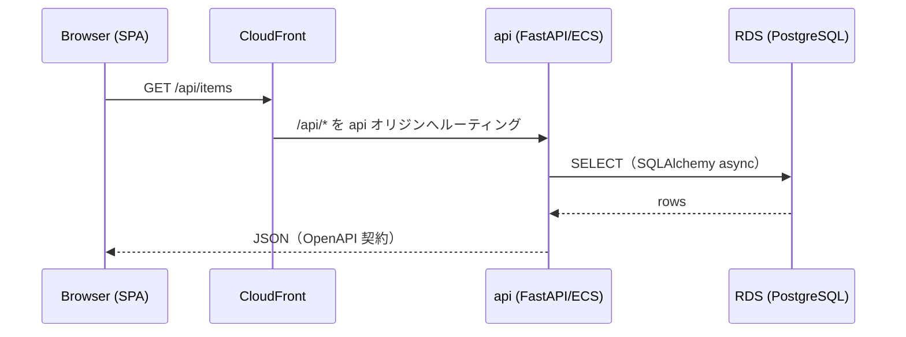

# 基本設計の図表方針

基本設計フェーズ（`design.md` / ADR / `docs/` の設計記述）でアーキテクチャ図・フロー図・
AWS 構成図を描くときのツール方針。図の形式を揃えることで、レビューしやすく差分を追える
状態を保つ。Epic [#66](https://github.com/iwata-jawsug-jp/devcon/issues/66) / 提案書
[§6・付録](../proposal/sdd-tooling-proposal.md) の方針に基づく。

> このディレクトリ `docs/design/` は将来的に「確定した基本設計の保管庫」も兼ねる（`.kiro/specs/`
> の作業成果物をリリース後にここへ昇格する運用は Epic #66 の #62 で確定予定）。本書はまず
> **図表の描き方**を定める。

## 既定: Mermaid

**原則 Mermaid を使う。** Markdown 内に直書きでき、GitHub 上でそのままレンダリングされ、
テキスト差分としてレビューできる。フロー図・シーケンス図・ER 図・簡易アーキ図はこれで足りる。

````markdown

````

上記は本リポジトリの「ブラウザ → CloudFront → api → RDS」の基本経路。GitHub 上でレンダリング
されることを確認してからコミットする。

図の種類の目安:

| 用途 | Mermaid 記法 |
| --- | --- |
| 処理フロー・分岐 | `flowchart` |
| リクエスト/レスポンスの流れ | `sequenceDiagram` |
| DB スキーマ・エンティティ関係 | `erDiagram` |
| 状態遷移 | `stateDiagram-v2` |
| 簡易な構成図 | `flowchart`（サブグラフでグルーピング） |

## 補助: 精密な AWS 構成図が必要なとき

Mermaid では表現しきれない、AWS 公式アイコン入りの精密な構成図が必要な場合のみ次を使う。

- **Python `diagrams`**（[diagrams.mingrammer.com](https://diagrams.mingrammer.com/)）:
  コードから構成図を生成。devcontainer に Python があるため `uv`/`pip` で導入して実行できる
  （描画には Graphviz が必要）。図の「ソース」が `.py` として残り差分を追える。
- **draw.io（AWS アイコン）**: GUI で精密に描きたい場合。**保存形式は `.drawio.svg`**
  （編集可能データを内包した SVG）とし、GitHub 上で画像として表示しつつ draw.io で再編集できる
  状態を保つ。既存例: [`docs/images/infra-architecture.drawio.svg`](../images/infra-architecture.drawio.svg)。

### `.drawio.svg` を触るときの注意

`.drawio.svg` は draw.io で round-trip 編集される。**圧縮済みの保存形式を壊さない**こと
（手で SVG を書き換えたり、別ツールで最適化して保存し直すと draw.io で開けなくなる）。
更新は draw.io で開いて編集 → 同じ `.drawio.svg` として上書き保存する。

## 使い分けの原則

1. まず **Mermaid** で描けないか考える（差分レビュー容易・追加依存ゼロ）。
2. AWS アイコン込みの精密さが要るときだけ **`diagrams` / draw.io** に切り替える。
3. どの形式でも「図のソース」を Git 管理し、PNG だけのコミット（再編集不能）は避ける。
