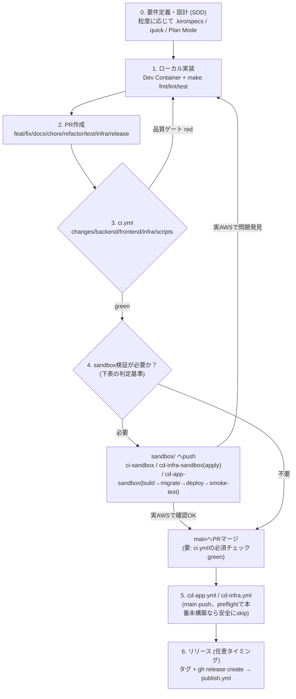

# アプリケーション開発プロセス・ブランチ戦略

このリポジトリでアプリケーション開発を進めるときの、要件定義からリリースまでの一連の流れ。
断片的に存在していた運用（SDD ワークフロー・`main`/`sandbox/*` のブランチ運用・
`ci.yml`/`cd-*.yml`）を、開発プロセスの各段階に対応づけて一つの流れとしてまとめたもの。

## 全体の流れ

- **0. 要件定義・設計**: 粒度に応じて SDD（`.kiro/specs/` フル／`/kiro-spec-quick`／Plan Mode）を
  使い分ける（[sdd.md](sdd.md)）。
- **1. ローカル実装**: Dev Container 内で `make fmt`/`lint`/`test` を回す。
- **2. PR 作成**: `main` から 1 issue = 1 ブランチ。命名規則・記録規律は [issues.md](issues.md) を参照。
- **3. `ci.yml`**: PR ごとに変更のあったエリア（`changes`/`backend`/`frontend`/`infra`/`scripts`）
  だけを検証する。`main` へは `main-ci-required` ルールセットでこの 5 ジョブが必須ステータス
  チェックになっている（[infrastructure.md](infrastructure.md#ブランチ保護github-rulesets)）。
- **4. sandbox 検証（必要な場合のみ）**: 実 AWS 環境でしか検証できない変更は、`main` へ入れる前に
  `sandbox/*` で確認する。要否の判定基準は次節。
- **5. `main` マージ後**: `cd-app.yml`/`cd-infra.yml` が動く。`apply` は手動 `workflow_dispatch`
  かつ `INFRA_APPLY_ENABLED` が必須で、本番インフラが未構築の間は `preflight` が安全に skip する
  （[infrastructure.md](infrastructure.md)）。
- **6. リリース**: 任意のタイミングでタグ + `gh release create`。`publish.yml` が公開ミラーへ
  変換パブリッシュする（release.md）。

## いつ `sandbox/*` 検証が必須か

| 変更の種類                                                         | sandbox検証                                   | 理由                                                                                                              |
| ------------------------------------------------------------------ | --------------------------------------------- | ----------------------------------------------------------------------------------------------------------------- |
| `infra/**`（Terraform リソース変更）                               | **必須**                                      | `terraform plan` だけでは実 apply 時の挙動・依存関係を保証できない                                                |
| `.github/workflows/cd-*.yml`（デプロイパイプライン変更）           | **必須**                                      | デプロイの正しさはデプロイでしか検証できない                                                                      |
| `services/**` で DB マイグレーション・認証・環境変数注入を伴う変更 | **必須**                                      | ローカル/CI には存在しないデプロイ環境固有の構成（CSP・VPC 経路等）が絡む。CLAUDE.md の「4th gate」原則と同じ理由 |
| `services/**` の通常の機能追加・バグ修正（上記に該当しない）       | 不要                                          | `ci.yml` の unit/integration テストで十分。ローカル green = CI green の原則どおり                                 |
| `ci.yml` 等 CI 専用ワークフロー変更                                | 不要（`ci-sandbox.yml` で追従を確認する程度） | AWS 認証を伴わないため                                                                                            |
| `docs/**`・提案書等                                                | 不要                                          | 実行系に影響しない                                                                                                |

この判定結果は PR の説明に一言（例:「sandbox/xxx で検証済み: `<run URL>`」）残す。
`issues.md` の既存の記録規律（着手時/原因ごと/完了時にコメント）に載せる形にする。

## ブランチ戦略

トランクベース開発（`main` が常にデプロイ可能）+ 短命フィーチャーブランチ + 実 AWS 検証専用の
`sandbox/*`。`dev`/`stg` のような永続ブランチは導入しない — 環境の分離は「ブランチ」ではなく
「`main` マージ後の `cd-*.yml` が向き先とする AWS リソース」で行う。ブランチを環境の数だけ増やすと
マージのたびに複数ブランチへの反映が要り運用コストが増すため、単一開発者体制の現状には見合わない。

| ブランチ                                                                | 起点                                         | マージ先                                                                   | 寿命                              | 用途                                                                |
| ----------------------------------------------------------------------- | -------------------------------------------- | -------------------------------------------------------------------------- | --------------------------------- | ------------------------------------------------------------------- |
| `feat/`/`fix/`/`docs/`/`chore/`/`refactor/`/`test/`/`infra/`/`release/` | `main`                                       | `main`                                                                     | 短命（1 issue分）                 | 通常開発。1 issue = 1 ブランチ = 1 PR                               |
| `sandbox/*`                                                             | `main`（`sandbox/main`）または任意の作業起点 | どこにも入らない（行き止まり、`sandbox-isolation` ルールセットで強制済み） | 検証が終わるまで（teardown 推奨） | 実 AWS でのインフラ・デプロイ検証専用                               |
| `main`                                                                  | —                                            | —                                                                          | 恒久                              | 常にデプロイ可能な状態を保つ。直接コミット禁止（`CONTRIBUTING.md`） |

## CI/CD の対応

| 段階                    | トリガー            | ワークフロー                                                                                             | 現状の挙動                                               |
| ----------------------- | ------------------- | -------------------------------------------------------------------------------------------------------- | -------------------------------------------------------- |
| PR 作成                 | `pull_request`      | `ci.yml`                                                                                                 | パス変更のあるエリアのみ実行、他は skip（skip=合格扱い） |
| PR（`infra/**` 変更時） | `pull_request`      | `cd-infra.yml` の `plan`                                                                                 | `TF_ENV=dev` で plan のみ、PR にコメント                 |
| sandbox 検証            | `push: sandbox/**`  | `ci-sandbox.yml`/`cd-infra-sandbox.yml`（apply）/`cd-app-sandbox.yml`（build→migrate→deploy→smoke-test） | 実 AWS へ実際に適用・デプロイ                            |
| main マージ             | `push: main`        | `cd-app.yml`/`cd-infra.yml`（`apply` は手動 `workflow_dispatch` のみ、かつ `INFRA_APPLY_ENABLED` 必須）  | 本番インフラ未構築の間は `preflight` が安全に skip       |
| リリース                | GitHub Release 公開 | `publish.yml`                                                                                            | 公開ミラーへ変換パブリッシュ                             |

`main` の CI 必須チェック（`main-ci-required` ルールセット）の詳細は
[infrastructure.md](infrastructure.md#ブランチ保護github-rulesets) を参照。

## SDD との接続

`CONTRIBUTING.md` の適用基準をそのまま使う。

- 粒度の大きい新機能: `.kiro/specs/<feature>/` で要件定義→基本設計→タスク分解
- 単一の小機能: `/kiro-spec-quick`
- 軽微な修正: Plan Mode
- `tasks.md` → [issues.md](issues.md) の「1 issue → 1 focused PR」フローへ接続

## 関連ドキュメント

- [issues.md](issues.md) — 1 issue = 1 PR の既存フロー（正）
- [sandbox.md](sandbox.md) — sandbox 隔離ポリシー・検証手順
- [sdd.md](sdd.md) — SDD ワークフロー
- [infrastructure.md](infrastructure.md) — CI/CD 全体像・エリア別スイッチ・ブランチ保護
- [ci-cd-area-switches.md](ci-cd-area-switches.md) — エリア別/オプトイン方式スイッチ
