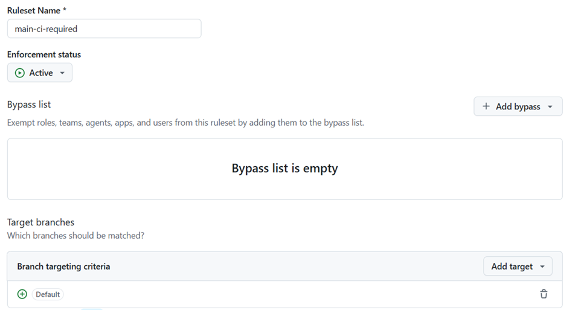
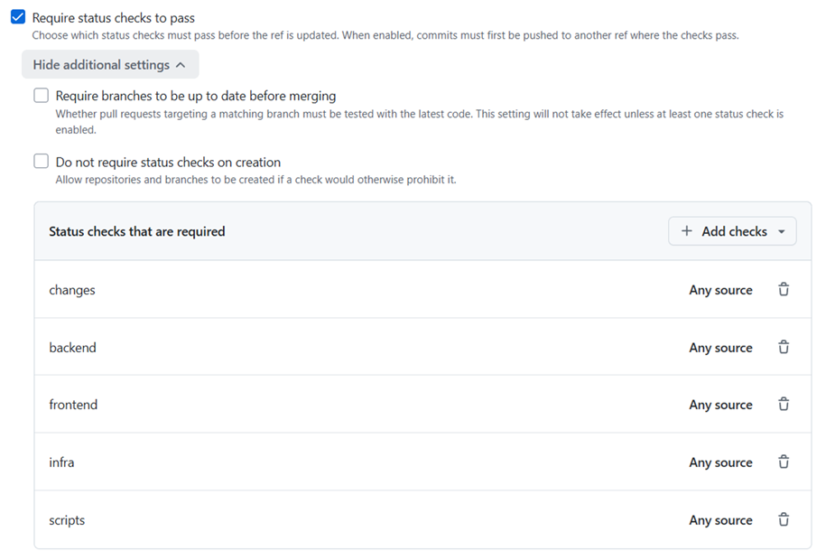

# インフラ・CI/CD 開発ガイド

`infra/`（Terraform）と `.github/workflows/`（GitHub Actions）の構造・運用。
全体のアーキテクチャは [`../CLAUDE.md`](../CLAUDE.md) を参照。

## 全体像


> 図は draw.io で編集可能な `*.drawio.svg`（`docs/images/infra-architecture.drawio.svg`）。
> draw.io で開くと SVG に埋め込まれた図を直接編集できる。以下はテキスト版。

```
infra/bootstrap/   ── 初回のみ・ローカル state ──▶  state バケット（S3 ネイティブロック）
                                                    GitHub OIDC プロバイダ / CI IAM ロール
        │ （上記が CI とリモート state の土台になる）
        ▼
infra/（アプリ層） ── リモート state ──▶  web=S3+CloudFront / api=ECR+ECS / shared=VPC ほか
        ▲
        │ cd-infra.yml（plan/apply）が管理
GitHub Actions ── OIDC でロール引受（長期キーなし）
```

リージョン既定は `ap-northeast-1`。全リソースは provider の `default_tags` でタグ付け。

---

## Terraform 2 層構成

### 1. `infra/bootstrap/`（初回のみ・ローカル state）

パイプラインが動く**前に一度だけ**ローカル state で適用する土台。`cd-infra.yml` の管理対象外。

作成するもの:

- **S3 state バケット**（バージョニング + SSE + public-access-block + 非 HTTPS を拒否する
  TLS 限定バケットポリシー）。
  ロックは **S3 ネイティブロック**（`use_lockfile`）を使用し、DynamoDB は不要
  （ロックは state と同じバケットの `<key>.tflock` オブジェクト）。
- **GitHub OIDC プロバイダ**（`token.actions.githubusercontent.com`, aud `sts.amazonaws.com`）
- **CI 用 IAM ロール 2 つ**
  - `*-ci-plan` … PR 用の読み取り専用（plan）。AWS 管理の `ReadOnlyAccess`。
    state バケットへのアクセスは **`dev` キーのみ**に限定（`tfstate_access_plan`、#45/#153）:
    `cd-infra.yml` の plan ジョブは常に `TF_ENV=dev` で走るため、PR 経由の plan が
    prod/sandbox の state を読み書き・削除できないようにした（以前は `ci-deploy` と同じ
    バケット全体への read/write ポリシーを共有しており、PR を開くだけで理論上 prod state を
    削除できた）。ロック（`<key>.tflock`）の put/delete は plan にも必要なため許可するが、
    実体の state オブジェクトへの put/delete は許可しない（apply 専用）。
  - `*-ci-deploy` … main / `production` 用のデプロイ。**最小権限化済み**（#45）: 以前は
    `PowerUserAccess` だったが、`infra/*.tf` が実際に宣言するリソース種別（EC2 ネットワーク・
    ECS・ECR・ELB・RDS・S3・CloudFront・CloudWatch Logs・Application Auto Scaling・
    Cognito・SNS）ごとにスコープしたカスタマー管理ポリシー（`ci_deploy_network`/
    `ci_deploy_compute`/`ci_deploy_storage_cdn`/`ci_deploy_data`/`ci_deploy_auth`/
    `ci_deploy_observability`、`bootstrap/main.tf`）に置き換えた。**インラインポリシー
    （`aws_iam_role_policy`）ではなくカスタマー管理ポリシー（`aws_iam_policy` +
    `aws_iam_role_policy_attachment`）を使う**: ロールのインラインポリシーは全体で
    10,240 バイトの合計上限を共有するため、auth.tf/observability.tf 分（#258）を
    追加した時点でこの上限を超えて `terraform apply` が `LimitExceeded` で失敗した。
    カスタマー管理ポリシーは1本ごとに 6,144 文字の枠を持つ（ロールには最大10本まで
    アタッチ可）ため、この構造的な制約を避けられる。IAM 自体の権限（ECS タスクロールの
    作成・PassRole）は元から `${var.project}-*` ロール名にスコープ済み（`ci_deploy_iam`）。
    追加の絞り込み（#45）として、リージョン依存サービス
    （EC2/ECS/ECR/RDS/CloudWatch Logs/ELB/Application Auto Scaling）の各ステートメントに
    `aws:RequestedRegion` 条件（`var.aws_region` 限定）を付与し、`elasticloadbalancing:*`/
    `application-autoscaling:*`/`cloudfront:*` のアクション丸ごとワイルドカードは
    `infra/*.tf` が宣言するリソース種別から導ける個別アクションへ絞り込み、
    `iam:PassRole` は `iam:PassedToService`（`ecs-tasks.amazonaws.com` 限定）付きの
    独立ステートメントへ分離した。IAM/S3/CloudFront はグローバル性質のため
    `aws:RequestedRegion` は付けていない（誤検知で `AccessDenied` になるリスクを避けた）。
    **注意**: `bootstrap/` は `cd-infra.yml` の管理対象外 — このポリシー変更は
    CI では自動適用されない。ローカルで `cd infra/bootstrap && terraform apply` を
    実行して初めて反映される。CloudTrail 等の実アクセス履歴からではなく静的なリソース種別
    分析から導出したため、初回 apply/デプロイで `AccessDenied` が出た場合は
    該当アクションを追加すること。
  - いずれも assume-role を OIDC の `sub`/`aud` 条件（org/repo）で制限

> **`*-ci-deploy` は sandbox と prod で同一ロール（判断の記録、#153 finding #10/#306）**
>
> `deploy_subjects`（`bootstrap/main.tf`）は `ref:refs/heads/main` / `environment:production` に
> 加えて `ref:refs/heads/sandbox/*` も信頼するため、`sandbox/*` ブランチへの push も同じ
> `ci-deploy` ロールを引き受けられる。上記の最小権限化（#45）はリソース**種別**単位のスコープで
> あり、`${var.project}-*` という名前パターンは環境（dev/sandbox/prod）を区別しない —
> つまり IAM ポリシー自体は sandbox 用の呼び出しであっても理論上 prod 名のリソースを操作できる
> 権限を持つ。実際の隔離は IAM ではなく次の 2 点に依存している:
>
> 1. sandbox-guard（[sandbox.md](sandbox.md)）が `sandbox/*` → 非 `sandbox/*` への PR/マージを
>    禁止し、sandbox 上のコードが正規レビューを経ずに main へ混入できないようにしている。
> 2. `cd-infra-sandbox.yml` は `TF_ENV=sandbox` を固定でハードコードし、`cd-app-sandbox.yml`
>    は `SANDBOX_` プレフィックス付きのリポジトリ変数（#392）でリソース識別子を解決する
>    ため、通常の実行経路では sandbox の state/tfvars・sandbox 用リソースしか触れない。
>
> **現状の判断（このリポジトリが単独運用者の push 権限のみを前提とする間）**: 上記2点を
> 実質的な隔離境界として受け入れ、sandbox 専用の deploy ロールは新設しない。push 権限を
> 持つこと自体が main への直接コミットや `workflow_dispatch` での prod apply とほぼ同じ
> 信頼レベルを意味するため、ロール分離による追加の防御効果は限定的で、bootstrap 層の
> 複雑化コストに見合わない。**複数コントリビューターが push 権限を持つ体制に変わった場合は
> 再検討する**（sandbox 専用ロールを新設し、リソース ARN を環境名で区別する方向）。

> **Terraform バージョン要件**: bootstrap 層は `>= 1.9`、アプリ層は `>= 1.11`
> （S3 ネイティブロック `use_lockfile` のため）。ローカルで bootstrap / マイグレーションを
> 触る場合は **1.11 以上**を入れておけば両層で通る（CI/CD の workflow は `1.13.0` に統一）。

> **新規 AWS アカウント/リージョンでの前提条件**: `bootstrap/main.tf` は `ci_deploy` の
> IAM ポリシーを最小権限に絞るため、アカウントの AWS 管理 KMS キーのデフォルトエイリアス
> （`alias/aws/rds` / `alias/aws/secretsmanager`）を `data "aws_kms_alias"` で参照する。
> これらのエイリアスは、そのアカウント/リージョンで該当サービス（RDS のデフォルトキー
> 暗号化 / Secrets Manager のデフォルトキーでのシークレット作成）を一度も使っていないと
> AWS 側で遅延生成されず存在しない。未使用の新規アカウントで `terraform apply` すると
> `Error: reading KMS Alias (alias/aws/secretsmanager): empty result` のように失敗する。
> 発生したら、対象アカウントの認証情報で一度だけ次を実行してキーを温めてから
> `apply` をやり直す（`alias/aws/rds` 側で同様のエラーが出た場合は、同じ要領で
> 暗号化した RDS インスタンスを一つ作成/削除すればよい）:
>
> ```bash
> aws secretsmanager create-secret --name kms-bootstrap-warmup --secret-string x
> aws secretsmanager delete-secret --secret-id kms-bootstrap-warmup --force-delete-without-recovery
> ```

```bash
cd infra/bootstrap
terraform init                 # ローカル state（backend ブロックなし）
terraform apply                # 一度だけ
terraform output               # state バケット名 / ロール ARN を控える
```

出力した値を後段に配線する:

- `state_bucket_name` → **リポジトリ変数** `AWS_TF_STATE_BUCKET`。`cd-infra.yml` は
  各ジョブ冒頭で `env/<env>.backend.hcl.example` の `REPLACE-ME-tfstate` をこの値に
  置換して `backend.hcl` を生成し（`*.tfvars` は `.example` をコピー）、init/plan する。
  `backend.hcl` / `*.tfvars` は git-ignored のまま CI 実行時に組み立てる方式で、秘密値は
  git にもログにも入らない（バケット名は非機密、RDS マスターパスワードは RDS 管理＝
  Secrets Manager で state/tfvars に出ない）。ローカルで触る場合は同様に `.example` から
  `infra/env/<env>.backend.hcl` を自前で穴埋めする。
- `ci_plan_role_arn` / `ci_deploy_role_arn` → **リポジトリ変数**（`cd-infra.yml` /
  `cd-app.yml` が参照）。`gh` で登録する例:

```bash
gh variable set AWS_TF_STATE_BUCKET --body "$(terraform -chdir=infra/bootstrap output -raw state_bucket_name)"
gh variable set AWS_PLAN_ROLE_ARN   --body "$(terraform -chdir=infra/bootstrap output -raw ci_plan_role_arn)"
gh variable set AWS_DEPLOY_ROLE_ARN --body "$(terraform -chdir=infra/bootstrap output -raw ci_deploy_role_arn)"
```

> **これら 3 変数を登録するまで `cd-infra.yml` の plan/apply は失敗する**（下記「bootstrap
> 適用前の CI 挙動」を参照）。

### 2. アプリ層（`infra/*.tf`・リモート state）

`cd-infra.yml` が管理。`backend.tf` は **部分設定**（`backend "s3" {}`）で、env ごとの
hcl を渡して初期化する。

> ファイル名・リソース論理名の `api`/`web` は `services/backend/python` / `services/frontend`
> という**アプリ側のディレクトリ名とは独立**（[ADR-0004](adr/0004-rename-services-by-role-and-nest-backend-by-language.md)）。
> リソース名を追従させるとリソースの再作成（replace）を招くため、意図的に変更していない。

| ファイル                                                                      | 内容                                                                                                                                                                             |
| ----------------------------------------------------------------------------- | -------------------------------------------------------------------------------------------------------------------------------------------------------------------------------- |
| `main.tf`                                                                     | レイヤ共通の locals（`name_prefix`）・データソース（caller identity / region）                                                                                                   |
| `network.tf`                                                                  | VPC（2 AZ・public/private subnet・IGW）、app SG / db SG。TODO: NAT ゲートウェイ（private subnet の egress 用）                                                                   |
| `endpoints.tf`                                                                | ECR / CloudWatch Logs / Secrets Manager 向け VPC インターフェースエンドポイント + S3 ゲートウェイエンドポイント（NAT なしで Fargate タスクがプライベートリンク経由でアクセス）   |
| `db.tf`                                                                       | **RDS for PostgreSQL**（private subnet・暗号化・非公開・Secrets Manager マネージド認証）                                                                                         |
| `web.tf`                                                                      | SPA 配信（S3 + CloudFront（OAC）+ セキュリティヘッダーポリシー）。TODO: カスタムドメイン用の ACM 証明書 / Route53（`var.domain_name` 設定時のみ）                                |
| `api.tf`                                                                      | ECR リポジトリ + ECS Fargate（クラスタ・タスク定義・サービス）+ ALB + Application Auto Scaling（CPU/メモリのターゲット追跡、#44）。代替案としてコメントに Lambda + API GW も記載 |
| `shared.tf`                                                                   | CloudWatch ロググループ、ECS タスク実行ロール / タスクロール（IAM）                                                                                                              |
| `observability.tf`                                                            | CloudWatch アラーム（ALB 5xx/レイテンシ、ECS CPU/メモリ、RDS CPU/接続数/空き容量）+ 通知用 SNS トピック（#42）                                                                   |
| `providers.tf` / `versions.tf` / `variables.tf` / `outputs.tf` / `backend.tf` | 共通定義                                                                                                                                                                         |

`endpoints.tf` のインターフェースエンドポイント（ECR api/dkr・Logs・Secrets Manager、tracing
有効時は xray も）は `var.vpce_single_az`（**dev/sandbox既定は`true`、prodは`false`**）で
1 AZ / 2 AZ を切り替える。2 AZ は ENI 数が単純に倍になり、トラフィックに関係ない固定費
（4エンドポイント換算で月額 約$80、#153 finding #11）が発生するため、可用性が要らない
dev/sandbox は既定で 1 AZ にしてコストを半減させている。

### データベース（RDS for PostgreSQL）

- `db.tf` の RDS は **private subnet** に置き、`db` セキュリティグループで **app SG からの
  5432 のみ**許可（パブリックアクセス不可）。
- マスター認証情報は **RDS マネージド**（`manage_master_user_password = true` → Secrets
  Manager）。Terraform state にパスワードを残さない。ECS タスクには接続情報＋シークレット
  ARN を注入する（`api.tf` 参照）。
- 保管時暗号化・自動バックアップ・IAM 認証・Performance Insights を有効化。multi-AZ /
  削除保護 / final snapshot は env 変数（dev は安価、prod は堅牢）。
- **マイグレーションの適用は CD（`cd-app.yml` の専用ジョブ）**が担う（下記）。

### API（ECS Fargate）のオートスケール（#44）

`api.tf` の `aws_appautoscaling_target` + `aws_appautoscaling_policy`（CPU / メモリの
target tracking、2本）。`aws_ecs_service.api` は `desired_count` を `lifecycle.ignore_changes`
で無視しているため、初期作成後は Application Auto Scaling とデプロイパイプライン
（`cd-app.yml` の `update-service`）が実際の値を管理する。

- `ecs_min_capacity` / `ecs_max_capacity` / `ecs_cpu_target_value` / `ecs_memory_target_value`
  （`variables.tf`）で調整。**dev は `min == max == 1` でスケール実質無効化**、
  **prod は `min=1, max=4` で実際にスケールする**（`env/{dev,prod}.tfvars.example` 参照）。
  スケールアウトは 60 秒、スケールインは 300 秒のクールダウン（頻繁な増減を避ける）。
- ALB リクエスト数ベースのターゲット追跡（`ALBRequestCountPerTarget`）は未導入。CPU/メモリで
  不足する場合に追加を検討。

### 可観測性（アラーム・通知、#42）

`observability.tf` が `aws_cloudwatch_metric_alarm` 7 本（ALB 5xx・レイテンシ、ECS
CPU・メモリ、RDS CPU・接続数・空き容量）を `aws_sns_topic.alerts` に紐づける。

- `var.alert_email` が空文字なら email 購読（`aws_sns_topic_subscription`）自体を作らない
  （`count`）。**dev の既定値は空**（使い捨て環境でアラーム疲れを避ける）。**prod で apply
  する前に `env/prod.tfvars` の `alert_email` を実際の宛先に差し替えること。**
- しきい値（`alarm_*_threshold` / `alarm_*_seconds` / `alarm_*_bytes`、`variables.tf`）は
  env ごとに上書き可能。RDS 接続数は現行のインスタンスクラス（dev: `db.t4g.micro` ≈110接続、
  prod: `db.t4g.small` ≈225接続）を踏まえた値を `env/{dev,prod}.tfvars.example` に設定して
  いるため、インスタンスクラスを変える際は見直すこと。
- `aws_cloudwatch_dashboard.main`（`${name_prefix}-overview`）で上記アラームと同じ指標
  （ALB 5xx/レイテンシ、ECS CPU/メモリ、RDS CPU/接続数/空き容量）を1枚にまとめている。
  URL は `terraform output cloudwatch_dashboard_url`。
- **分散トレーシング**（[ADR-0007](adr/0007-opentelemetry-adot-sidecar-for-distributed-tracing.md)）:
  `var.otel_traces_enabled`（**dev既定はfalse、prodはtrue**）で ADOT コレクタサイドカーを
  `aws_ecs_task_definition.api` に追加し、backend（OpenTelemetry計装済み、
  `services/backend/python/src/api/tracing.py`）からのトレースを OTLP-gRPC で受け取って
  AWS X-Ray へ転送する。true にすると: タスクの cpu/memory を 256/512 → 512/1024 に増やし、
  `xray` の VPCインターフェースエンドポイント（`endpoints.tf`）と、task role への
  `AWSXRayDaemonWriteAccess` アタッチ（`observability.tf`）が有効になる（＝月額固定費が増える）。
- **ヘルスチェック**: `GET /api/health`（`services/backend/python/src/api/routers/health.py`）が
  `SELECT 1` で DB 疎通を確認するようになった。DB 不通なら `503` を返し `{"database": "error"}`
  になる（従来は DB が全断でも `200 {"status": "ok"}` を返していた — #153 finding #10）。
  ALB のターゲットグループヘルスチェック（`api.tf` の `health_check`）も同じパスを見ているため、
  DB 障害時は自動的にターゲットが unhealthy になり、ALB がトラフィックを止める
  （＝ DB 障害を握りつぶさず、素早く外形に反映する設計判断）。
- **SLI/SLO（提案、しきい値は未確定）**: 可用性 SLI = ALB `HTTPCode_Target_2XX_Count` /
  （`2XX+4XX+5XX`合計）、レイテンシ SLI = `TargetResponseTime` の p95。目標値・エラーバジェット
  運用は、このダッシュボード運用で数ヶ月分のベースラインが取れてから検討する
  （DORA メトリクス [ADR-0006](adr/0006-dora-deployment-frequency-and-lead-time-definitions.md)
  と同じ方針: 先に観測、しきい値は後で）。合成監視（CloudWatch Synthetics 等の外形監視）は
  今回未導入 — ALB ヘルスチェック + アラームで当面代替する。

```bash
# リモート state で初期化（env ごとの backend hcl を指定）
make tf-init BACKEND=env/dev.backend.hcl
# もしくは:
cd infra && terraform init -backend-config=env/dev.backend.hcl

make tf-plan      # infra/env/dev.tfvars があれば自動で -var-file
make tf-validate
make tf-lint
make security     # Trivy + Checkov
```

### env ごとの設定ファイル

`*.example` のみコミットし、実ファイル（`*.tfvars` / `*.backend.hcl`）は git-ignored。

```
infra/env/
├── dev.tfvars.example          # project/environment/aws_region など
├── prod.tfvars.example
├── dev.backend.hcl.example     # bucket/key/region/use_lockfile/encrypt
└── prod.backend.hcl.example
```

```bash
cp infra/env/dev.backend.hcl.example infra/env/dev.backend.hcl   # bootstrap 出力で穴埋め
cp infra/env/dev.tfvars.example      infra/env/dev.tfvars
```

### 規約

- 2 スペースインデント、`terraform fmt`（`make tf-fmt`）。
- タグは provider の `default_tags` で一括付与（個別リソースに手書きしない）。
- state はリモート（S3 + ネイティブロック `use_lockfile`）。`*.tfstate` はコミットしない。

---

## CI/CD（GitHub Actions）

`.github/workflows/` に配置。CI は Makefile / pre-commit と同じゲートを通すので
「ローカルで green == CI で green」。

| ワークフロー   | トリガー         | 役割                                                    |
| -------------- | ---------------- | ------------------------------------------------------- |
| `ci.yml`       | PR / main push   | 変更パスのみ per-service で検証                         |
| `cd-infra.yml` | PR / 手動        | Terraform plan（PR）/ apply（手動 `workflow_dispatch`） |
| `cd-app.yml`   | main push / 手動 | アプリのビルド & デプロイ                               |
| `publish.yml`  | Release 公開     | 公開リポジトリへのミラー（release.md）    |


### ブランチ保護（GitHub Rulesets）

`main`（`~DEFAULT_BRANCH`）に `main-ci-required` ルールセットを設定している
（`required_status_checks`: `changes`/`backend`/`frontend`/`infra`/`scripts`、`ci.yml` の
5ジョブすべて）。エリア別スイッチで skip されたジョブは「合格」扱いなので、該当エリアの
変更が無い PR は引き続き skip でマージできる。変更があるのに赤い PR はマージボタンが
物理的に押せなくなる。

「CI が green になるまで issue は完了ではない」（[issues.md](issues.md)）という規律は、
これでドキュメント・AI エージェントの運用だけでなく GitHub 側でも強制される
（[development-process.md](development-process.md)）。

`gh` で作成する例（admin 権限が必要）:

```bash
gh api -X POST repos/<org>/<repo>/rulesets \
  -f name='main-ci-required' -f target='branch' -f enforcement='active' \
  -F 'conditions[ref_name][include][]=~DEFAULT_BRANCH' \
  -F 'rules[][type]=required_status_checks' \
  -F 'rules[][parameters][required_status_checks][][context]=changes' \
  -F 'rules[][parameters][required_status_checks][][context]=backend' \
  -F 'rules[][parameters][required_status_checks][][context]=frontend' \
  -F 'rules[][parameters][required_status_checks][][context]=infra' \
  -F 'rules[][parameters][required_status_checks][][context]=scripts'
```

設定できない環境では、**Settings → Rules → Rulesets → New ruleset** で名前を
`main-ci-required`（`make check-setup` が参照する名前と一致させる）とし、対象を **デフォルト
ブランチ**（`~DEFAULT_BRANCH`）にしたうえで `Require status checks to pass` に `changes` /
`backend` / `frontend` / `infra` / `scripts`（`ci.yml` の5ジョブ）を追加する。





sandbox 隔離用の `sandbox-isolation`（`guard` 必須）は別ルールセットで、
[sandbox.md](sandbox.md) を参照。

### エリア別スイッチ（リポジトリ変数）

CI / CD をエリア単位で一時停止できるキルスイッチ。リポジトリ変数（Variables）を
ジョブレベルの `if` で評価する（GitHub Actions の仕様で `on:` トリガーでは `vars` を
参照できないため、無効時も実行レコードは「skipped」として残る）。

| 変数               | 影響範囲                                                           |
| ------------------ | ------------------------------------------------------------------ |
| `BACKEND_ENABLED`  | `ci.yml` の backend / `cd-app.yml` の build → migrate → deploy-api |
| `FRONTEND_ENABLED` | `ci.yml` の frontend / `cd-app.yml` の frontend                    |
| `INFRA_ENABLED`    | `ci.yml` の infra / `cd-infra.yml` の plan・apply（手動含む）      |

判定は `vars.X != 'false'` — **未設定ならデフォルト有効**で、明示的に `false` を
登録したときだけ止まる（公開ミラーや fork では変数未設定のため現行動作のまま）。

```bash
gh variable set BACKEND_ENABLED --body "false"   # backend の CI/CD を停止
gh variable delete BACKEND_ENABLED               # 復帰（または --body "true"）
```

> 注: `if` でスキップされたジョブは required status check として**合格扱い**になる。
> スイッチ OFF の間はそのエリアの検証なしで PR がマージ可能になる点に注意。

Web UI での設定・動作確認・注意事項の詳細は
[ci-cd-area-switches.md](ci-cd-area-switches.md) を参照。

> **`LIVE_SMOKE_ENABLED`（`cd-app.yml` の `smoke-test`）・`INFRA_APPLY_ENABLED`
> （`cd-infra.yml` の `apply`）は上記と極性が逆**のオプトインスイッチ（`vars.X == 'true'`
> のときだけ実行、**未設定ならデフォルト無効**）。詳細は後述の各セクションを参照。

### `ci.yml`

パスフィルタで、変更のあったサービスのジョブだけ実行する。

- **api**: `uv sync` → ruff → mypy → pytest
- **web**: `npm ci` → eslint → `vue-tsc --noEmit` → vitest → build（→ Playwright e2e）
- **infra**: `terraform fmt -check` → `init -backend=false` → validate → tflint → checkov + trivy

### `cd-infra.yml`

- **PR**: `terraform plan` を実行し、結果を PR にコメント（plan ロール）。
- **apply（手動）**: `workflow_dispatch` で手動実行する `terraform apply`（deploy ロール・
  `TF_ENV=prod`）。private repo ＋現プランでは GitHub Environment の required reviewers が
  使えないため、**main マージでは自動 apply せず**、手動実行そのものをゲートとする
  （`production` 環境はデプロイ記録用）。deploy ロールの OIDC 信頼条件は `environment:production`
  も受理するため、`apply` job の `if` は `github.ref == 'refs/heads/main'` も必須にしている
  （さもないと任意のブランチからの `workflow_dispatch` で prod へ apply できてしまう、#301）。
  さらにリポジトリ変数 `INFRA_APPLY_ENABLED` を `true` にしない限り実行されない**デフォルト
  無効のオプトイン**（`workflow_dispatch` 権限と変数編集権限という別々の鍵が両方必要になる
  二重ゲート）。`ci.yml` の infra 静的チェックと `plan` は AWS へ変更を加えないため対象外
  （引き続き `INFRA_ENABLED` の既定＝有効のまま）。詳細は
  [ci-cd-area-switches.md](ci-cd-area-switches.md#infra_apply_enabledcd-infrayml-の-apply)
  を参照。

#### 承認ゲートの恒久化（Enterprise / Team / Pro へ移行、または public 化した場合）

GitHub Environment の保護ルール（**required reviewers** / wait timer / deployment branch policy）は
**public リポジトリでは無料**、**private リポジトリでは Pro / Team / Enterprise** で利用できる。
現状は private ＋無料プランのため API が `422`（`billing plan ... required reviewers protection
rule`）を返し設定できないので、上記のとおり apply を手動 `workflow_dispatch` ゲートにしている。

対応プランに移行（または public 化）したら、本来の「main マージ → `production` 環境の承認ゲートで
待機 → 承認で apply」に戻せる。手順:

1. `production` 環境に required reviewers を設定（UI: Settings → Environments、または API）:

   ```bash
   gh api --method PUT repos/<org>/<repo>/environments/production --input - <<'JSON'
   { "wait_timer": 0, "prevent_self_review": false,
     "reviewers": [{ "type": "User", "id": <REVIEWER_USER_ID> }],
     "deployment_branch_policy": null }
   JSON
   # 単独運用で自分が承認者なら prevent_self_review=false。チームなら true 推奨。
   # reviewers は Team も可: { "type": "Team", "id": <TEAM_ID> }
   ```

2. `.github/workflows/cd-infra.yml` の `apply` を「main push で起動」に戻す:
   - `on:` に `push: { branches: [main], paths: ['infra/**', '.github/workflows/cd-infra.yml'] }`
     を復活（`workflow_dispatch` は残しても良い）。
   - `apply` ジョブの `if:` を
     `${{ github.event_name == 'push' && github.ref == 'refs/heads/main' }}` に戻す。
   - `apply` ジョブの `environment: production` は既にあるので、保護ルールが効けば
     **マージで apply がキューされ、承認されるまで待機**する（無承認の自動 provision は起きない）。

3. 動作確認: infra 変更を含む PR をマージ → cd-infra の `apply` が「Waiting / Review required」で
   停止 → 承認で初めて `terraform apply` が走ることを確認する。

> 注: 移行するまでは手動 `workflow_dispatch` がゲート。prod を立てる時は Actions →
> **CD Infra** → **Run workflow** で apply を起動する。

> **bootstrap 適用前の CI 挙動（重要）**
>
> `cd-infra.yml` の `plan`（PR）/ `apply`（手動 `workflow_dispatch`）は **OIDC でロールを
> 引き受けてから**動く。
> `infra/bootstrap/` を一度 apply し、出力したロール ARN を `AWS_PLAN_ROLE_ARN` /
> `AWS_DEPLOY_ROLE_ARN` に、state バケット名を `AWS_TF_STATE_BUCKET` に登録するまでは、
> **AWS 認証ステップ（`configure-aws-credentials`）で必ず失敗する**。これは想定挙動であり
> リグレッションではない。`AWS_TF_STATE_BUCKET` 未設定の場合は、認証を越えても直後の
> `terraform init`（backend.hcl のバケットが空）で失敗する。
>
> 一方 `ci.yml` の `infra` ジョブ（fmt / validate / tflint / checkov / trivy）は **AWS 認証
> 不要**なので、bootstrap 未適用でも green になる。PR で「`infra` は緑なのに `plan` が赤」と
> なっていたら、まず bootstrap とロール ARN 変数の登録状況を確認すること。

### `cd-app.yml`（インフラ作成後に有効化）

- **api**: `build`（ECR へ push, tag=SHA）→ **`migrate`（専用ジョブ）** → `deploy-api`（ECS 更新）。
  - `migrate` は、ビルドした image で **api タスク定義の新リビジョンを register** し、その
    リビジョンで **一回限りの Fargate タスク**（`aws ecs run-task`）を private subnet 内に起動して
    `uv run --no-sync alembic upgrade head` を実行、終了コード 0 を待ってから次へ進む（失敗時は
    サービスを更新しない）。`--no-sync` は private subnet に egress が無いため。
  - `deploy-api` は migrate が register した**新リビジョンへ `update-service`** して roll する。
    ECR は IMMUTABLE タグのため、`force-new-deployment` だけでは新イメージが反映されない。
- **web**: `npm run build` → `dist/` を S3 へ同期 → CloudFront を無効化。
- **smoke-test**（第4のゲート、#373/#376、ADR-0008）: `deploy-api`/`frontend` 成功後、
  実ブラウザ（Playwright `live-smoke` プロジェクト、`services/frontend/e2e/live-smoke/`）で
  実際に Cognito Hosted UI ログイン → 認証付き書き込み（`POST /api/items`）→ 別ブラウザ
  コンテキストからの整合性確認（`GET /api/items/{id}`）まで通す。テストユーザーは
  per-run 使い捨て（`cognito-idp:AdminCreateUser`/`AdminSetUserPassword`/`AdminDeleteUser`、
  `infra/bootstrap/main.tf` の `ci_deploy_auth`）。失敗時は run URL・デプロイ SHA・失敗した
  ステップ（S1/S2/S3）を含む issue を `e2e-live` ラベルで自動起票する（`docs/issues.md`の
  「バグは直す前に issue へ記録する」運用をワークフローに埋め込んだもの）。
  `CLOUDFRONT_DOMAIN_NAME` / `COGNITO_USER_POOL_ID` のいずれかが未設定なら警告付きで
  スキップされ、deploy 自体はブロックしない（sandbox の運用は docs/sandbox.md 参照）。
  **ジョブ自体はリポジトリ変数 `LIVE_SMOKE_ENABLED` を `true` に設定するまで実行されない
  （デフォルト無効のオプトイン）**。下記エリア別スイッチ（デフォルト有効のオプトアウト）とは
  極性が逆なので注意（`infra/bootstrap` の `ci_deploy_auth` 権限適用前に本番デプロイを
  ブロックしないための安全策。適用・検証が済んだら有効化する）。

参照する変数（リポジトリ Variables、プレフィックスなし）: `AWS_DEPLOY_ROLE_ARN`
（sandbox/production 共用）に加え、`ECR_REPOSITORY` / `WEB_BUCKET` /
`CLOUDFRONT_DISTRIBUTION_ID` / `ECS_CLUSTER` / `ECS_SERVICE` / `ECS_TASK_FAMILY` /
`PRIVATE_SUBNET_IDS` / `APP_SECURITY_GROUP_ID`（smoke-test はさらに
`CLOUDFRONT_DOMAIN_NAME` / `COGNITO_USER_POOL_ID`）。

**これらのプレフィックスなしの変数はまだ何も登録されていない**（本番用の別インフラが
存在しないため）。`preflight` はこれを正しく「未設定」と検知し、以降のジョブをすべて
スキップする。`cd-app-sandbox.yml` は同じ役割の変数を `SANDBOX_` プレフィックス付きで
別途登録・参照するため（[sandbox.md](sandbox.md) 参照）、両ワークフローが同じリソースを
指してしまうことはない（#392 — 当初 GitHub Environments でのスコープ分離を試みたが、
`environment:` 宣言は OIDC トークンの `sub` クレームを変え deploy ロールの trust policy
に弾かれたため、IAM 変更が要らないプレフィックス方式に変更した）。本番用インフラを
実際にプロビジョニングした際は、その出力をプレフィックスなしの変数名で登録すれば
ワークフロー変更なしに有効化される。

### `metrics-dora.yml`（DORAメトリクス計測）

`cd-app.yml` の実行結果と merge 済み PR から、デプロイ頻度・変更リードタイムを集計
（`workflow_dispatch` のみ、手動実行時に直近7日分を集計）し、job summary と
[docs/metrics/](metrics/README.md) に記録する。計測定義は
[ADR-0006](adr/0006-dora-deployment-frequency-and-lead-time-definitions.md)を参照（issue #237）。

### 定期実行ワークフローについて（`metrics-dora.yml` / `perf.yml`）

この2つのワークフローは元は `schedule`（cron）トリガーを持っていたが、現在は
`workflow_dispatch` のみで手動実行に限定している。この monorepo は学習・デモ目的で実トラフィックが
なく、`cron` で定期実行しても意味のあるデータが貯まらない（DORAメトリクスは実デプロイが、
perfテストは実運用相当の負荷傾向がないと指標として機能しない）ため。

**本番運用のアプリを開発する場合は、初期設定の一環として `schedule` トリガーを追加し直すこと**:

- `metrics-dora.yml`: `on:` に以下を追加（毎週月曜 00:00 UTC に直近7日分を自動集計）。

  ```yaml
  schedule:
    - cron: '0 0 * * 1'
  ```

- `perf.yml`（[app-development.md](app-development.md)参照）: `on:` に以下を追加
  （毎週日曜 03:00 JST に実行。issue #43 の方針「PRでは軽め、定期/リリース前に本番相当」）。

  ```yaml
  schedule:
    - cron: '0 18 * * 0'
  ```

再有効化時は、両ワークフローの冒頭コメントもこの前提（学習・デモ目的でdispatch限定にしている旨）
を削除・更新すること。

### CI/CD のルール

- **長期 AWS キーを置かない。** 認証は GitHub OIDC → ジョブごとに IAM ロールを引き受ける
  （PR=plan ロール / main=deploy ロール）。`AWS_ACCESS_KEY_ID` を Secret に追加しない。
- **デプロイは CI で行い、手元で行わない。** `terraform apply` やイメージ push を手動で
  実行しない（`.claude/settings.json` が `terraform apply`/`destroy`/`aws`/`git push` を
  確認ゲートにしている）。
- 秘密は GitHub Environments / SSM / Secrets Manager から。コミットしない。

---

## ブートストラップ順序（新規 clone から）

1. `make setup` — ツールチェーンと git フック。
2. `infra/bootstrap/` をローカル state で一度だけ apply（state バケット・ロック表・OIDC・IAM ロール）。
3. アプリ層をリモート state に移行: `terraform init -backend-config=env/<env>.backend.hcl`
   （既存ローカル state があれば `-migrate-state`）。
4. 初回の `cd-infra.yml` でアプリ基盤をプロビジョニング → その後 `cd-app.yml` を有効化。

## 関連ドキュメント

- [app-development.md](app-development.md) — api / web のアプリ開発
- [sandbox.md](sandbox.md) — `sandbox/*` 隔離ブランチで CI/CD・アプリ・環境構築を実 AWS 検証（ゴールデンパスの一部として公開対象）
- [metrics/README.md](metrics/README.md) — DORAメトリクス（デプロイ頻度・変更リードタイム）
- [`../CLAUDE.md`](../CLAUDE.md) — アーキテクチャと規約の正
