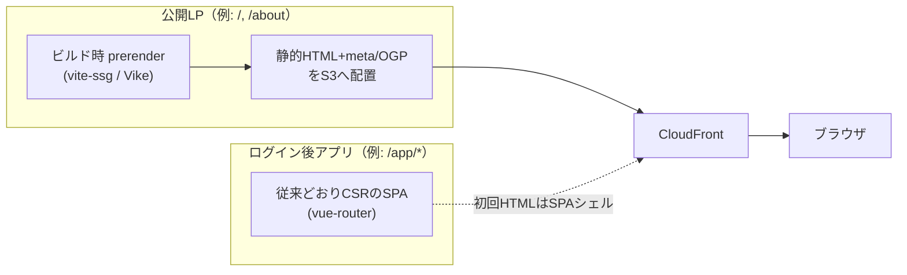

# services/web サイト構成モダナイズ 提案書

**対象:** `services/web`（Vite + Vue 3 + TypeScript SPA）
**作成日:** 2026-07-01
**目的:** 現行の Vite + Vue 3 SPA / S3 + CloudFront 静的配信というアーキテクチャ（`CLAUDE.md`）を
維持したまま、2026 年時点でインターネット上主流となっているサイト構成のベストプラクティスを取り入れ、
「公開 LP（マーケティング面）＋ ログイン後アプリ（業務面）が混在するサイト」として実装可能な形に育てる。

前提はユーザーとの合意事項:

- 最終的な性格は **公開 LP とログイン後アプリの混在**（SEO/初期表示が要る面と、要らない面が同居する）。
- **フレームワーク移行（Nuxt 等）はスコープ外**。現行 SPA 構成の枠内で強化する。

---

## 1. 背景・目的

`services/web` は現状 Vite の初期スキャフォールドに `HealthBadge`（`/api/health` 疎通確認）を足した
だけの雛形で、Epic [#46](https://github.com/iwata-jawsug-jp/devcon/issues/46) が言う「テンプレート →
プロダクト」の入口段階にある。同エピックの子 issue はドメイン機能（[#40](https://github.com/iwata-jawsug-jp/devcon/issues/40)）・
認証（[#41](https://github.com/iwata-jawsug-jp/devcon/issues/41)）・可観測性（[#42](https://github.com/iwata-jawsug-jp/devcon/issues/42)）
等、主に **バックエンド／インフラ側** をカバーしており、**フロントエンドを「サイト」として構成する
観点**（レンダリング戦略・SEO・セキュリティヘッダ・PWA・デザインシステム・a11y・パフォーマンス予算等）
は手つかずのまま。本提案はそのギャップを埋める。

## 2. 現状整理

| 観点                    | 現状                                                                                                                     |
| ----------------------- | ------------------------------------------------------------------------------------------------------------------------ |
| レンダリング            | 純クライアントレンダリング SPA（`index.html` は空の `
` のみ）                                              |
| SEO / メタ情報          | `<title>web</title>` 固定のみ。OGP・構造化データ・per-route meta・sitemap・robots.txt なし                               |
| セキュリティヘッダ      | CloudFront に `response_headers_policy` なし（CSP/HSTS/X-Content-Type-Options 等 未設定、`infra/web.tf` 確認済み）       |
| PWA                     | Web App Manifest・Service Worker なし                                                                                    |
| デザインシステム        | UI コンポーネントライブラリ・デザイントークンなし（素の Vue SFC）                                                        |
| データ取得              | `src/api/client.ts` の素の `fetch` ラッパーのみ。キャッシュ・再試行・楽観的更新なし                                      |
| フォーム/バリデーション | 未着手（items CRUD 自体が骨組みのため）                                                                                  |
| アクセシビリティ        | CI での自動チェックなし                                                                                                  |
| パフォーマンス予算      | バンドルサイズ・Lighthouse 等の CI ゲートなし                                                                            |
| フロントエンド観測性    | RUM・エラートラッキングなし（Epic [#42](https://github.com/iwata-jawsug-jp/devcon/issues/42) はインフラ/バックエンド中心） |
| 認証 UI                 | 未着手（バックエンド認証 [#41](https://github.com/iwata-jawsug-jp/devcon/issues/41) 自体が未実装のため前提が揃っていない） |

## 3. 2026 年の潮流（調査結果）

- **レンダリング戦略はハイブリッドが定番。** 純 CSR の SPA は SEO・初期表示に弱く、SSR はサーバー
  負荷、SSG はビルド時生成で最速だが動的面に不向き — 実際のサイトは「公開面は静的生成、ログイン後は
  CSR」のように複数手法を組み合わせるのが主流。
- **「クローラーにだけ別コンテンツを返す」dynamic rendering / cloaking は 2026 年時点で Google が
  明確に非推奨。** 採用するなら **全ユーザーに同一の静的 HTML を返す build-time prerender（真の
  SSG）** に限定する必要がある。`vite-ssg` / [Vike](https://vike.dev/)（旧 vite-plugin-ssr）は
  ルート単位で `prerender: true` の静的ページと `ssr: false` の SPA ページを混在させられ、Vite
  エコシステム内で完結する（フレームワーク移行なし）。
- **Core Web Vitals は実質的な合格ラインが定まっている。** INP ≤ 200ms（p75）、LCP ≤ 2.5s、
  CLS ≤ 0.1。RUM 計測と JS バンドル予算（目安: インタラクティブページで gzip 後 400KB 以下）が
  前提になっている。
- **セキュリティは CSP を含むセキュアヘッダ必須が前提。** OWASP Top 10:2025 準拠、`unsafe-inline`
  ではなく nonce/hash ベースの CSP が推奨。
- **PWA（インストール可能・オフライン対応）は多くのプロダクトで標準装備**になりつつあり、ネイティブ
  アプリ代替としてのコストパフォーマンスが評価されている。
- **デザインシステム／コンポーネント駆動開発が標準。** Storybook 等の生きたドキュメントを伴う
  コンポーネント設計が前提になっている。
- **サーバー状態の取得・キャッシュは専用ライブラリ（TanStack Query 等）に任せるのが定番**で、手組みの
  `fetch` + ストアによる状態同期は避けられる傾向。

## 4. レンダリング戦略の選択肢

| 案                                                | 概要                                                                                         | 長所                                                                                                           | 短所                                                                                                                     |
| ------------------------------------------------- | -------------------------------------------------------------------------------------------- | -------------------------------------------------------------------------------------------------------------- | ------------------------------------------------------------------------------------------------------------------------ |
| A. 現状維持＋運用面のみ強化                       | SPA のまま、SEO 以外（セキュリティヘッダ・PWA・a11y 等）だけ強化                             | 変更コスト最小                                                                                                 | 公開 LP の SEO・初期表示・OGP 共有が弱いまま残る                                                                         |
| **B. `vite-ssg` / Vike でハイブリッド化（推奨）** | 公開 LP ルートのみ build-time prerender（真の SSG）、ログイン後ルートは従来どおり CSR の SPA | Vite/Vue Router 資産をそのまま流用でき、フレームワーク移行不要。cloaking にも該当しない（全員に同じ静的 HTML） | ビルドパイプラインに 1 ステップ追加。公開/非公開ルートの切り分け設計が必要                                               |
| C. Nuxt 3 へのフルマイグレーション                | SSR/SSG フレームワークへの本格移行                                                           | 業界標準、エコシステム充実                                                                                     | **今回の合意事項（現行 SPA 構成の枠内）に反するためスコープ外**。移行コスト大、CloudFront/インフラ設計の全面見直しが必要 |

**推奨は B。** 「公開 LP は SEO・初期表示重視、ログイン後アプリはインタラクティブ SPA」という
サイトの性格と、「現行 SPA 構成を維持する」という制約の両方を満たせる。

## 5. 推奨する強化テーマ（Epic の子 issue 想定）

1. **公開 LP のハイブリッドレンダリング化**: `vite-ssg`（または Vike）を PoC 導入し、公開ルートのみ
   build-time prerender。あわせて per-route の `<title>`/OGP/構造化データ（JSON-LD）管理、
   `sitemap.xml` / `robots.txt` を整備する。
2. **CloudFront セキュリティヘッダ整備**: `infra/web.tf` に Response Headers Policy を追加し、
   CSP（nonce/hash ベース）・HSTS・`X-Content-Type-Options` 等を設定する。
3. **PWA 化**: `vite-plugin-pwa` で Web App Manifest + Service Worker を導入し、インストール可能・
   オフラインキャッシュに対応する。
4. **デザインシステム／UI コンポーネント方針の選定**: コンポーネントライブラリ（例: PrimeVue / Naive UI /
   shadcn-vue 系）または Tailwind + トークン方式を比較検討し、最小のデザインシステムを立ち上げる。
5. **データ取得層の刷新**: TanStack Query（Vue 版）を導入し、`src/api/client.ts` の生成型
   （`schema.ts`）と組み合わせてキャッシュ・再試行・楽観的更新を標準化する。
6. **アクセシビリティ対応 + CI ゲート**: WCAG 2.2 AA を目標に、`axe-playwright` 等を既存の
   Playwright E2E に組み込み CI で自動チェックする。
7. **パフォーマンス予算 + Lighthouse CI 導入**: バンドルサイズと Core Web Vitals（LCP/INP/CLS）を
   CI で計測し、しきい値超過で fail させる。

**スコープ外・連携先として明記するもの:**

- **フロントエンド観測性（RUM・エラートラッキング・`web-vitals` 計測）** は既存の可観測性エピック
  [#42](https://github.com/iwata-jawsug-jp/devcon/issues/42) の範囲と重なるため、新規 issue は作らず
  同エピックの子として連携する。
- **認証 UI（ルートガード・トークン/セッション管理）** はバックエンド認証
  [#41](https://github.com/iwata-jawsug-jp/devcon/issues/41) が完了してから着手する依存関係として
  明記するのみに留め、本提案の子 issue には含めない。

## 6. 導入ステップ（ロードマップ）

1. **PoC**: テーマ 1（`vite-ssg` ハイブリッド化）を最小の公開ページ 1 枚で試し、cloaking にならない
   構成（全ユーザー同一 HTML）であることをビルド出力で確認する。
2. **並行導入**: テーマ 2（セキュリティヘッダ）・6（a11y ゲート）・7（パフォーマンス予算）は既存構成に
   対する追加のみで依存が少なく、PoC と並行して着手できる。
3. **段階導入**: テーマ 4（デザインシステム）・5（データ取得層）は既存コンポーネントの置き換えを伴うため、
   小さな画面から順次移行する。
4. **PWA（テーマ 3）** は 1〜3 が定着してから、対象範囲（公開 LP のみか、アプリ全体か）を決めて着手する。

## 7. 留意点・既知の制約

- **cloaking 回避が絶対条件。** prerender はボット判定でコンテンツを出し分けず、全ユーザーに同じ
  静的 HTML を返す方式（`vite-ssg` の `prerender: true` 相当）に限定する。
- **すべてのテーマを 1 issue に詰め込まない。** Epic #46 と同じ運用（親 issue は方針検討、決まった
  範囲ごとに 1 issue → 1 focused PR）に倣う。
- **CloudFront の設定変更は `sandbox/*` で実 AWS 検証してから `main` へ**（sandbox.md 方針）。
- **認証（#41）が未実装の間は、認証 UI に関する意思決定を急がない。** 先に決めすぎるとバックエンド
  設計との齟齬が生じるリスクがある。

## 関連ドキュメント

- [`../../CLAUDE.md`](../../CLAUDE.md) — アーキテクチャの正（`web` は静的 SPA、CloudFront 配信）。
- Epic [#46](https://github.com/iwata-jawsug-jp/devcon/issues/46) — プロダクト化ロードマップ（本提案はその一部）。
- [#40](https://github.com/iwata-jawsug-jp/devcon/issues/40) ドメイン機能拡充 / [#41](https://github.com/iwata-jawsug-jp/devcon/issues/41) 認証 / [#42](https://github.com/iwata-jawsug-jp/devcon/issues/42) 可観測性 — 隣接エピック。
- [design/README.md](../design/README.md) — 本書の図表は Mermaid 方針に準拠。
