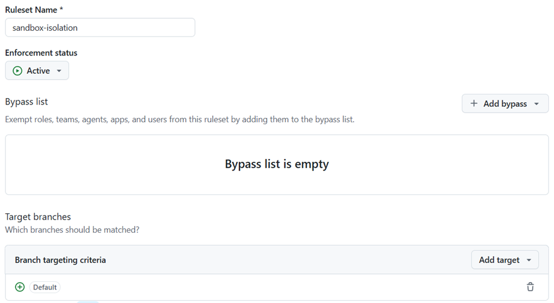
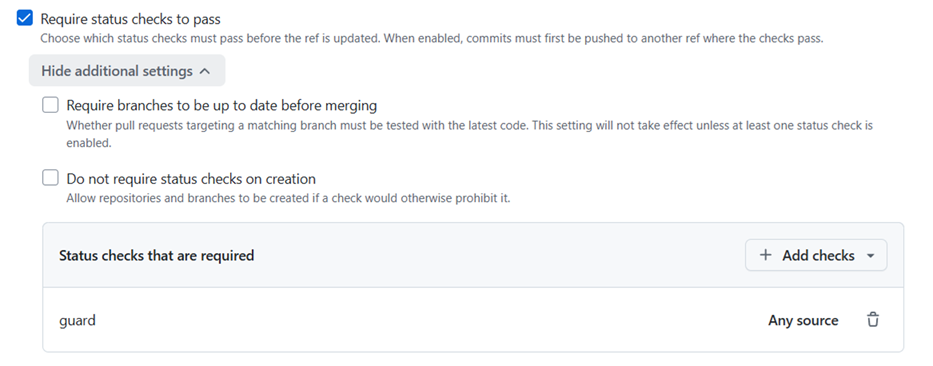

# sandbox 開発環境

`sandbox/` で始まるブランチは、**実 AWS を使う隔離環境**。`main` / `production` /
公開リポジトリに一切影響させずに、主に**アプリケーション開発**に使う —
DB マイグレーションや新機能を、実 RDS / ECS など本物の AWS リソースに対して
end-to-end で試す（`cd-app-sandbox` で build→migrate→deploy）。機能開発が終わるまで
長期稼働する（[development-process.md](development-process.md)
が定めるアプリケーション開発プロセスの一部）。

ローカルの Dev Container（[development-environment.md](development-environment.md)）が
「手元での開発」、sandbox が「クラウド上での使い捨て検証・開発」という位置づけ。

> sandbox はゴールデンパスの一部として**公開リポジトリ（`iwata-jawsug-jp/devcon`）にも
> ミラーされる**（release.md 参照）。fork した人も同じ`sandbox/*`フローで
> 実AWS検証・アプリ開発ができる。


## 隔離ポリシー（重要）

- **`sandbox/*` ブランチは、それ以外（非 sandbox）のブランチへ PR/マージできない。**
  `sandbox/*` は行き止まり。`sandbox/*` → `sandbox/*` は可。
- 強制は `.github/workflows/sandbox-guard.yml`（`pull_request` で head=`sandbox/*` かつ
  base≠`sandbox/*` なら fail）+ **必須ステータスチェック化**（下記ルールセット）。
- sandbox 整備そのもの（このドキュメントや workflow の追加）は **通常の `feat/`/`docs/`
  ブランチ**で行い main へマージする（sandbox/* からはマージできないため）。

## 専用ワークフロー（`push: [sandbox/**]` で発火）

| ファイル                                 | 役割                                                                                                                                                        |
| ---------------------------------------- | ----------------------------------------------------------------------------------------------------------------------------------------------------------- |
| `.github/workflows/ci-sandbox.yml`       | ci.yml のミラー（api/web/infra ゲートを sandbox 枝で実行）                                                                                                  |
| `.github/workflows/cd-infra-sandbox.yml` | cd-infra apply のミラー（TF_ENV=sandbox・deploy ロール・production ゲートなし）。`workflow_dispatch` での destroy も持つ（[teardown](#teardown後始末)参照） |
| `.github/workflows/cd-app-sandbox.yml`   | cd-app のミラー（build→migrate→deploy-api / web）。app 基盤（ECS 等）が存在する前提                                                                         |

## workflow_dispatch実行時の必須条件（OIDCのref制約、重要）

上記3ワークフロー（と `cd-sandbox-cycle.yml`）が assume する deploy ロールの OIDC 信頼ポリシー
（`infra/bootstrap/locals.tf` の `deploy_subjects`）は、**`ref:refs/heads/main` または
`ref:refs/heads/sandbox/*` からの `AssumeRoleWithWebIdentity` しか許可しない**
（[infrastructure.md](infrastructure.md)）。`workflow_dispatch` は GitHub 上どのブランチからでも
起動できてしまう（トリガー自体に `ref` の制限はない）ため、それ以外のブランチ
（例: `feat/*`・`fix/*`・`infra/*`・`test/*`）を `--ref` に指定して実行すると、
**コードは何も間違っていないのに** 以下の手順で確実に失敗する:

1. `Configure AWS credentials (deploy role)` ステップが `Not authorized to perform
sts:AssumeRoleWithWebIdentity` を約12回（指数バックオフ、合計 2 分強）リトライしたのち失敗。
2. これは Terraform が実行される **前** の段階なので、AWS リソースは何も作成・変更されない
   （後片付けは不要）。`cd-sandbox-cycle.yml` の `apply` がこの形で失敗した場合、後続の
   `teardown` も同じ理由で失敗するのが正常な挙動（`if: always()` で走るが、同じ deploy
   ロールを assume できないため、こちらもリトライ後に失敗する）。

**実際に複数回発生している既知のパターン**（2026-07-19・2026-07-23、`cd-sandbox-cycle.yml`/
`test/*`・`infra/*` ブランチからの `workflow_dispatch`）。エラーメッセージから「バグでは」と
早合点しがちだが、原因は常にこの `ref` 制約であり、ワークフロー実装の欠陥ではない。

**対処**: まだ `main` にマージしていない変更（`.github/workflows/cd-*.yml` 自体の変更を含む）を
sandbox 実機で検証したい場合は、検証専用の一時的な `sandbox/*` ブランチへ push してから、
そのブランチを `--ref` に指定する。

```bash
git switch -c sandbox/<検証用の名前>
git push -u origin sandbox/<検証用の名前>
gh workflow run cd-sandbox-cycle.yml --ref sandbox/<検証用の名前>
```

`main` から直接検証してよい場合（変更が既に `main` にマージ済み）は `--ref main` のままでよい
（[週次エフェメラルサイクル](#週次エフェメラルサイクル376-pr④)の例を参照）。

## `infra/bootstrap/`（state バケット / OIDC / IAM ロール層）は検証対象外

`cd-infra(-sandbox).yml` はどちらも `working-directory: infra`（アプリ層: VPC/ECS/RDS 等）にのみ
`terraform apply` する。`infra/bootstrap/` は対象外で、`sandbox/*` へ push しても **何も適用され
ない**（bootstrap 層は CI/CD が assume する OIDC ロール自体を作る層のため、パイプラインから
自己適用できない——鶏と卵の関係）。`ci(-sandbox).yml` の `Validate bootstrap layer` ステップも
`fmt`/`validate`/`tflint`/`checkov` の読み取り専用チェックのみで、実 AWS への適用確認にはならない。

`infra/bootstrap/` を変更した場合（例: deploy ロールの IAM ポリシー変更）:

1. 実 AWS 認証情報を持つ人が手元で直接適用する: `cd infra/bootstrap && terraform init -reconfigure
&& terraform apply`。
2. 適用後、`main` の `cd-infra`/`cd-app`（必要なら `sandbox/*` へ push してそのミラー）が
   `AccessDenied` なく green のままであることを確認してから PR をマージする。

## 前提（一度だけ）

1. **bootstrap 適用**: state バケット + OIDC + IAM ロール。deploy ロールの信頼条件には
   `repo:<org>/<repo>:ref:refs/heads/sandbox/*` が含まれる（`infra/bootstrap/locals.tf` の
   `deploy_subjects`）ので、任意の `sandbox/*` から deploy ロールを assume できる。
2. **リポジトリ変数（`SANDBOX_` プレフィックス付き）**:
   - `AWS_DEPLOY_ROLE_ARN`（cd-infra-sandbox / cd-app-sandbox / cd-infra / cd-app 共通の
     assume 対象ロール ARN。sandbox/production どちらのブランチから assume するかは
     IAM の trust policy 側で制御しているため、この変数自体はプレフィックスなしでよい）
   - `cd-app-sandbox.yml` はリソース識別子の変数を **`SANDBOX_` プレフィックス付きで**
     参照する（全11個の一覧は
     [repository-variables.md「4. sandbox 用」](repository-variables.md#4-sandbox-用12個sandbox-プレフィックス手動登録)
     参照）。**プレフィックスなしの名前
     （`ECS_CLUSTER` 等）では登録しないこと** — `cd-app.yml` 側はプレフィックスなしの
     同名変数を読むため、もし登録してしまうと `cd-app.yml` がそれを本番用インフラの
     出力だと誤認し、本番用の別インフラが無いまま sandbox のリソースへ誤ってデプロイ
     してしまう（#392 で実際に発生し、`main` の `migrate` ジョブが連続失敗した）。
     > 補足: 当初は GitHub Environments（`environment: sandbox`）でのスコープ分離を
     > 試みたが、`environment:` を宣言したジョブは OIDC トークンの `sub` クレームが
     > `repo:<org>/<repo>:ref:refs/heads/sandbox/*` から
     > `repo:<org>/<repo>:environment:sandbox` に変わり、`infra/bootstrap` の
     > deploy ロール信頼ポリシーが許可していない組み合わせになって
     > `AssumeRoleWithWebIdentity` が失敗した。プレフィックス方式なら IAM 変更・
     > 追加の `terraform apply` なしで同じ分離効果が得られる。
   - デプロイ後 E2E スモークテスト（`cd-app-sandbox.yml` の `smoke-test` ジョブ、#376）を
     動かす場合は追加で `SANDBOX_CLOUDFRONT_DOMAIN_NAME` も設定し、`infra/bootstrap/` の
     `CognitoAdminUsers` ステートメント（下記コラム参照）を適用しておく。未設定/未適用
     なら `preflight` と同様に警告付きでスキップされるだけで、build/deploy 自体は
     妨げない。

```bash
gh variable set AWS_DEPLOY_ROLE_ARN --body "$(terraform -chdir=infra/bootstrap output -raw ci_deploy_role_arn)"
gh variable set SANDBOX_CLOUDFRONT_DOMAIN_NAME --body "$(terraform -chdir=infra output -raw cloudfront_domain_name)"
```

3. **sandbox env ファイル**（git-ignored・`.example`からの生成）: `cd-infra-sandbox.yml`の
   `apply`/`destroy`両ジョブが`.example`テンプレートから実行時に生成するため（#479/#484）、
   push/`workflow_dispatch`経由の検証では**手動コピーは不要**。ローカルで直接
   `terraform`を実行する場合のみ、手元で生成する:

```bash
cp infra/env/sandbox.backend.hcl.example infra/env/sandbox.backend.hcl   # bucket を bootstrap 出力で穴埋め
cp infra/env/sandbox.tfvars.example      infra/env/sandbox.tfvars
```

## 検証の流れ

```bash
# 1) sandbox 枝を作成（main から）
git switch main && git switch -c sandbox/main      # or sandbox/<topic>

# 2) infra/** か services/** を変更して push（sandbox env ファイルは push 後に
#    ワークフロー側が生成するので、事前コピーは不要）
git push -u origin sandbox/main

# 3) Actions で発火を確認
#    - CI (sandbox) / CD Infra (sandbox) [apply] / CD App (sandbox)
```

> ローカルで terraform を実 AWS に対して回す場合、SSO プロファイルによっては provider が
> 認証を取れないことがある。その場合は各コマンド前に一時認証情報を環境変数へ展開する:
> `eval "$(aws configure export-credentials --format env)"`
>
> Claude Code の `.claude/settings.json` は **read-only な aws / terraform plan 等を allow**、
> **`terraform apply`/`destroy` と `aws:*`（変更系）は ask（都度確認）** に設定している。
> 権限の自己拡張はエージェントではなく人がレビューして適用する運用。

## デプロイ後 E2E スモークテスト（第4のゲート、#373・#376・ADR-0008）

`cd-app-sandbox.yml` の `smoke-test` ジョブは、`deploy`/`frontend` の成功後に実ブラウザ
（Playwright Test runner、`services/frontend/e2e/live-smoke/`）で実際に Cognito Hosted UI
ログインを完走させ、認証付きの書き込み API（`POST /api/items`）と、別ブラウザコンテキストから
の整合性確認（`GET /api/items/{id}`）まで通す。#365・#367・#369 のような「ログイン〜認証付き
API 呼び出し」という業務アプリの必須経路が丸ごと壊れる実環境専用バグを、デプロイのたびに自動
検出するための第4のゲート。失敗時は trace/screenshot/video が Actions artifact として残る。

テストユーザーは **ジョブ実行ごとに作成・削除する使い捨て**（#376 で #373 の固定ユーザー方式
から変更）。これには `ci_deploy` ロールへの `cognito-idp:AdminCreateUser` /
`AdminSetUserPassword` / `AdminDeleteUser`（`infra/bootstrap/iam-ci-deploy-auth.tf` の
`ci_deploy_auth` `CognitoAdminUsers` ステートメント）が必要——`infra/bootstrap/` は CI 外・人力適用の層なので、
このリポジトリでこの権限を初めて使う場合は先に人が直接適用しておく:

```bash
cd infra/bootstrap
terraform init -reconfigure
terraform apply   # CognitoAdminUsers ステートメントを含む ci_deploy_auth ポリシーを更新
```

適用後、必要なリポジトリ変数（`AWS_DEPLOY_ROLE_ARN` / `CLOUDFRONT_DOMAIN_NAME` /
`COGNITO_USER_POOL_ID`）が揃っていれば、`smoke-test` ジョブが自動的にユーザーを作成 → テスト
実行 → 削除まで行う。固定ユーザーの事前登録（旧手順）はもう不要。

```bash
gh variable set CLOUDFRONT_DOMAIN_NAME --body "$(terraform -chdir=infra output -raw cloudfront_domain_name)"
```

上記いずれかが未設定/`CognitoAdminUsers` 未適用の間は、`smoke-test` ジョブは（`preflight` と
同じ「fail ではなく warning 付き skip」設計で）自動的にスキップされる — deploy/frontend 自体を
ブロックしない。

## 週次エフェメラルサイクル（#376 PR④）

`cd-sandbox-cycle.yml` は `apply → deploy → live-smoke → teardown` を1回の実行で完走させる
ワークフロー。上記の手動フロー（sandbox 枝を作る・push する・teardown する）を1ボタンで
再現し、**ゼロからのプロビジョニング特有の欠陥**（#436・#437 のように、長寿命の sandbox
環境では原理的に再現しない欠陥クラス）を定期的に検出するためのもの。

- **現状 `workflow_dispatch` のみ**（`schedule` トリガーは未設定）。理由は2つ:
  1. `metrics-dora.yml`/`perf.yml` と同じ判断（このリポジトリは学習・デモ目的で、無人の
     定期実行を正当化するほどの利用実績がまだない）。
  2. **`TF_ENV=sandbox` は単一の共有 state**。無人で週次 teardown が走ると、誰かが
     手動検証のために sandbox を使っている最中に**予告なく破棄してしまうリスク**がある。
     `schedule` を足すのは、少なくとも一度手動実行して所要時間・コストを把握し、かつ
     その時点で他に sandbox を使っていないことを確認できてから。
- **実行前に必ず、他に sandbox を使っていないか確認すること。** このワークフローは
  実行時点の sandbox 環境をまるごと apply → 差し替え → 破棄する。
- 判定は **alerting**（live-smoke 失敗時に `e2e-live` ラベルで issue 自動起票、ワークフロー
  自体は fail させない）。teardown は smoke-test の成否に関わらず実行される
  （`workflow_dispatch` の `skip_teardown: true` で調査用に環境を残せる、`if: always()`
  の teardown ジョブに `always() && inputs.skip_teardown != true` で反映）。
- `cd-infra-sandbox.yml`/`cd-app-sandbox.yml` の該当ジョブをステップ単位で複製する形で
  実装している（reusable workflow 化はしていない）— `ci-sandbox.yml` が `ci.yml` を複製
  している既存の drift（#153 指摘7）と同じトレードオフを、意図的に踏襲したもの。#295
  （reusable workflow 化）で解消する想定。

```bash
gh workflow run cd-sandbox-cycle.yml --ref main
# 環境を調査用に残したい場合:
gh workflow run cd-sandbox-cycle.yml --ref main -f skip_teardown=true
```

> `--ref` は必ず `main` か `sandbox/*` にすること。それ以外のブランチを指定すると
> OIDC の `ref` 制約により `AssumeRoleWithWebIdentity` が失敗する
> （[workflow_dispatch実行時の必須条件](#workflow_dispatch実行時の必須条件oidcのref制約重要)参照）。
> 未マージの変更を検証したい場合は一時的な `sandbox/*` ブランチを使う。

## teardown（後始末）

**推奨: `cd-infra-sandbox.yml` を `workflow_dispatch` で実行**（OIDC 経由、長期キー不要）。
`confirm_destroy` 入力に文字列 `destroy` を入力したときだけ `destroy` ジョブが走る
（誤操作防止。`apply` は引き続き push 限定で、`workflow_dispatch` からは実行されない）:

```bash
gh workflow run cd-infra-sandbox.yml --ref sandbox/<branch> -f confirm_destroy=destroy
```

ローカルで実行する場合（実 AWS 認証情報を手元に持つ場合のみ）:

```bash
cd infra
terraform init -reconfigure -backend-config=env/sandbox.backend.hcl
terraform destroy -var-file=env/sandbox.tfvars        # アプリ基盤を破棄
# 必要なら bootstrap も破棄（state バケットを空にしてから。prevent_destroy に注意）
git push origin --delete sandbox/main                 # sandbox 枝を削除
```

## 恒久保持の例外（`sandbox/ec-site-demo`）

`sandbox/*` は原則使い捨て（上記 teardown で削除）だが、`sandbox/ec-site-demo`（SDD 実践演習
[Epic #159](https://github.com/iwata-jawsug-jp/devcon/issues/159)）は**教材・参照用として恒久
保持**する例外（[#217](https://github.com/iwata-jawsug-jp/devcon/issues/217) で決定）。

- **削除しない**: GitHub ルールセットでブランチ削除を禁止（下記「GitHub ルールセット」参照）。
  `git push origin --delete sandbox/ec-site-demo` は失敗する想定。
- **公開ミラーには反映しない**: 公開は Release タグ契機で `main` を変換公開する方式
  （release.md）であり、`sandbox/*` は publish の対象 ref になり得ない。
  `publish` ワークフローを手動実行する際も、対象 ref に `sandbox/ec-site-demo` を指定しないこと。
- 他の `sandbox/*` ブランチと同様、**このブランチへの `sandbox/*` 以外からのマージは禁止**
  （隔離ポリシーは変わらない。恒久保持は「削除しない」だけの例外で、隔離を緩めるものではない）。

## GitHub ルールセット（sandbox-guard を必須化）

`sandbox-guard` を必須ステータスチェックにして、隔離ポリシーを強制する。`gh` で作成する例
（admin 権限が必要）:

```bash
gh api -X POST repos/<org>/<repo>/rulesets \
  -f name='sandbox-isolation' -f target='branch' -f enforcement='active' \
  -F 'conditions[ref_name][include][]=~DEFAULT_BRANCH' \
  -F 'rules[][type]=required_status_checks' \
  -F 'rules[][parameters][required_status_checks][][context]=guard'
```

設定できない環境では、**Settings → Rules → Rulesets → New ruleset** で名前を
`sandbox-isolation`（`make check-setup` が参照する名前と一致させる）とし、対象を **デフォルト
ブランチ**（`~DEFAULT_BRANCH`）にしたうえで `Require status checks to pass` に `guard`
（sandbox-guard の job 名）を追加する。

> 対象を全ブランチ（`~ALL`）にはしないこと。`sandbox-guard.yml` の `guard` ジョブは
> `pull_request` イベントでのみ起動するため、対象を `~ALL` にすると新規ブランチの
> **push 時点**（まだ PR も無く `guard` が一度も走っていない）で必須ステータスチェックを
> 満たせず、リポジトリ全体で新規ブランチの push がブロックされる（実際に発生した障害）。
> `~DEFAULT_BRANCH` であれば `main` へのマージ時（PR 経由）にのみ強制されるため、この問題は
> 起きない。





### 恒久保持ブランチの削除保護

上記の恒久保持例外（`sandbox/ec-site-demo`）は、対象を当該ブランチ 1 本に絞った別ルールセット
（`protect-ec-site-demo-retention`、作成済み）で削除を禁止する。`-F` によるネストした配列指定は
`exclude` の空配列を渡せず失敗するため、JSON ボディを直接渡す（admin 権限が必要。GitHub UI では
**Settings → Rules → Rulesets → New ruleset** → Target: 対象ブランチのみ →
Rules: `Restrict deletions` を有効化でも同等）:

```bash
gh api -X POST repos/<org>/<repo>/rulesets --input - <<'JSON'
{
  "name": "protect-ec-site-demo-retention",
  "target": "branch",
  "enforcement": "active",
  "conditions": {
    "ref_name": {
      "include": ["refs/heads/sandbox/ec-site-demo"],
      "exclude": []
    }
  },
  "rules": [
    { "type": "deletion" }
  ]
}
JSON
```

同じ隔離ポリシー（`sandbox/*` → 非 `sandbox/*` へのマージ禁止）は `sandbox-isolation` の対象
（`~DEFAULT_BRANCH`）で担保済みのため、このルールセットは削除禁止のみに絞る。

## 関連

- [infrastructure.md](infrastructure.md) — Terraform 2 層構成と本番の cd-infra / cd-app
